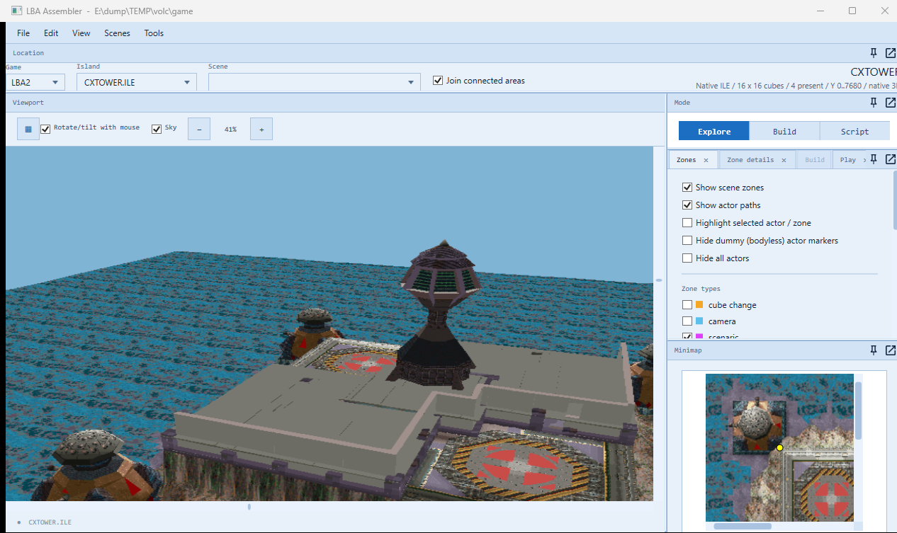
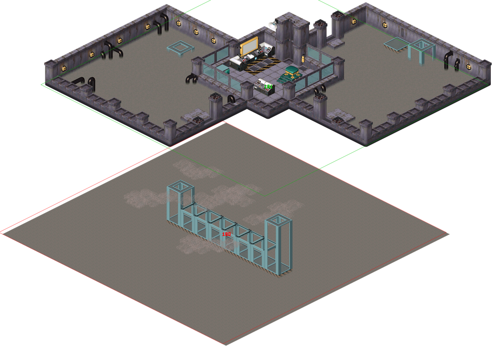
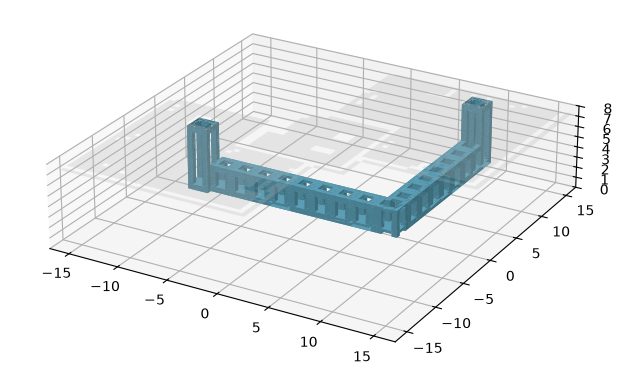
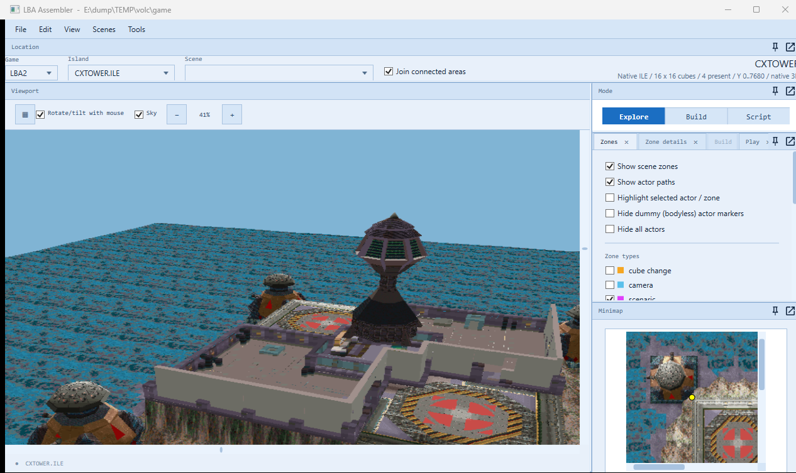

# Island CX's control tower, lower level, in 3D (2026-10-08)

The user: "Let's convert The "control tower, lower level" into a 3D island. The way we currently display it in the editor isn't how they
connect together 180: Island CX, Secret passage (room #126) needs moving underneath 181: Island CX, Room in the emperor (room #127), and
we'll probably need to do a little bit of stretching so it all fits where it's meant to. This is going to be an extra area for our island
CX track, we're going to start outside, enter through a door, drive around inside, and come back out again".

## The two scenes

- **181, the room** ("Room in the emperor..."): two L-shaped halls round a control room, the whole 64 x 64 cells of the scene. The halls'
  floor is layer 0. Three doors lead outside (Island CX's outside scene, 110), each with a landing two layers up (768) at the threshold.
  Two grates in the floor are the zones down into the secret passage: one in the south-west hall at cells (9-10, 34-35), one in the
  north-east hall under a four-legged frame at (46-47, 2-3).
- **180, the secret passage**: a walkway with a cage-like frame, four cells wide, hung between two open-frame shafts (cells x 21-24
  and 49-52, rows 34-37) over a floor far below with clouds over it. The shafts' tops are where Twinsen comes down from the grates: the
  first shaft's top is at layer 17, the second's at 24. The walkway's floor is layer 2.

The two don't fit as they are. The grates are 37 cells apart east and 32 north, but the shafts are 28 cells apart and in a straight line,
and their tops are 7 layers apart.

## In the editor's joined map

The map used to put the passage beside the room (moved 51 cells east so the two didn't overlap). Now it is underneath (`Lba2Areas`):
- the first shaft is under the first grate: 13 cells west and a row north, where both zones between the scenes put it;
- the whole passage is below the room's floor: the second shaft's top (layer 24, the passage's highest) is a layer under it;
- the room is lifted 54 layers on the picture so it stands clear above the passage, the way the Dark Monk Statue's levels are
  (`lba2screenlift <folder> 24 order=180,181`). The map counts as stacked (`IsStacked`): its scenes share plan columns, not cells.

The flat picture can't stretch the passage, so only the first shaft lines up there. The 3D island has both.

## The island: CXTOWER.ILE and CXTOWER.OBL

Island CX is one cube. On it, two L-shaped buildings sit sunk in trenches between the two landing pads (the octagons) and the block under
the control tower in the middle. They are the outside of the room: the same shape, half the size. The room's 64 cells are the plateau's
32 (cells 16-48), so `Terrain/ControlTower/ControlTowerIsland.cs` makes the island twice its size and puts the room in brick for brick:

- **The ground**: Island CX twice its size (`IslandScaler.Scale`, as for the Island of the Francos' track: 4 cubes, (7, 7) to (8, 8)).
  Every height is half again as high (1.5 times), so the plateau is at 7,680. It is flat at the doors' thresholds: the yards outside the
  doors are where the landing pads are, painted as they were. Under the room the ground is open down to 768, the passage's floor (the pit).
- **The room**: every filled cell is a box a brick across and a layer high, in its brick's colour matched in Island CX's palette (RESS 36).
  Only the faces that show are kept, merged into rectangles of one colour, in bodies of 16 x 16 cells; the filled cells are merged into
  collision boxes (`Terrain/Palace/BrickBuilding.cs`, shared with the Palace island). The old buildings' objects are taken away (25 of
  them); the four landing pads on their pillars at the corners stay, as high as their ground now is.
- **The doors**: the room's three doors are as the scene has them, 3 cells wide and 10 layers high, their landings level with the yards.
  Two open onto the south-east yard, one onto the north-west yard. Inside, the floor is 2 layers (512) below the landing.
- **The roofs**: one over each hall and the control room, as high as their low walls (layers 10 and 11). The tall walls (19 layers) stand
  through the roofs. The roofs are solid.
- **The control tower** (Island CX's own body) stands on the control room's pillars and tall walls, at 12,032.
- **The secret passage** hangs underneath, stretched to fit:
  - the first shaft is under the first grate, its posts 7 layers longer so its top reaches the floor as the second's does;
  - the walkway's 24 cells are repeated along an L under the floor: east from the first shaft for 33 cells (under the control room), a
    corner, then north for 27 cells;
  - the second shaft is under the second grate;
  - the two grates are open, so you can look down the shafts.

Counts: the room is 6,726 cells and the passage 1,310. That makes 29 bodies (6,732 faces, the three roofs among them) and 417 collision
boxes. The busiest cube has 141 objects, under the engine's 200. `CXTOWER.OBL` is `ILOTCX.OBL` twice its size with the building's bodies
added at the end (from body 14 on).

No scenes yet: the engine can't go there until a race track adds them. (The Island CX track will start in a yard, go in through a door,
round the halls and out again.)

## Making it

- Tools > **LBA2: Island CX control tower (3D)…** (`MainWindow.ControlTower.cs`) adds the two files to the game folder, builds them again,
  or takes them out. It is refused while test edits or the 1996 demo are open. The island appears in the Island list as `CXTOWER.ILE`
  (Island CX's palette).
- `ScriptRoundTrip cxtower <game folder> <out folder> [source folder] [--no-roofs] [--closed-grates]` builds the same files into another
  folder. The source folder holds pristine `ILOTCX.ILE` and `.OBL` (the game folder by default).
