# The proposed race tracks, built on the Desert island, Citadel Island and Mosquibees Island (2026-09-27, reworked 2026-09-29)

Three tracks are built by the same code: the Desert island's (this document's main subject), Citadel Island's town circuit (see "Citadel Island's town circuit") and Mosquibees Island's mountain lap (see "Mosquibees Island's mountain lap"). What differs between islands is `Terrain/RaceTrackIsland.cs`.

The picture the track came from is [racetrack/concept_track.png](racetrack/concept_track.png). It is built on a **copy** of the game, so nothing in the real game folders is touched.

| | |
|---|---|
| Where the copy is | `E:\dump\LBA2RaceTrackBuild\Game` (a plain copy of the "Level viewer" install without the CD images, `DOSBOX`, `DRIVERS` and the intro video except `VIDEO\VIDEO.HQR`, which the engine needs) |
| The originals of the files that change | `E:\dump\LBA2RaceTrackBuild\Pristine` (`DESERT.ILE`, `DESERT.OBL`, `SCENE.HQR`, `ANIM.HQR`, `RESS.HQR`); a build always starts from them, so it can be repeated |
| Files the build changes | `DESERT.ILE` (heights, ground triangles, decor objects), `DESERT.OBL` (three new decor bodies for the road bridge: a plain deck tile, an edge tile with the curb, and a railing), `SCENE.HQR` (scenes 55-73); for the jump also `ANIM.HQR` and `RESS.HQR` (its longer flight, see "The jump"); for Baldino's car `BODY.HQR` and `RESS.HQR` (see "Baldino's rocket car"). It writes `RACETRACK.JSON` beside them: the crossing style, the start line and the checkpoints, the opponent's line and actors, and the scene the race starts in, for Play's race-track mode |
| The game engine | LBA Assembler's Play runs the engine in its race-track mode on a folder with a race track built, and only then (see "The engine's race-track mode"): the car stays level on the bridge deck, has gears and the car setup, a lap counts only through every checkpoint, two opponents race round the lap (the retail track's racer and Baldino in his rocket car), and the gear, speed, lap times and race position are on screen. In the retail engine, or the community engine without that mode, the track and the jump work, but the car's body tilts over on the deck |
| To look at it | LBAAssembler > File > Settings > LBA2 folder = the copy, then Desert island (Explore), or Play: with the car setup's race start on (the default) Play starts the race in scene 67 beside the car, and with it off it plays whichever of scenes 55-73 is open |
| To rebuild | `ScriptRoundTrip buildtrack docs\racetrack\track_plan.json E:\dump\LBA2RaceTrackBuild\Pristine E:\dump\LBA2RaceTrackBuild\Game out.png 4` |

Pictures, all from the built copy:

- [Top-down map](racetrack/build/built_map.png). This renderer draws the ground only, so the bridge deck is not in it.
- [An earlier route over your picture](racetrack/build/built_over_concept.png): cyan is the lap before the retail track's area was added and the crossing re-shaped.
- In the game:
  - [the start line](racetrack/build/h_start.png)
  - [the water bridge](racetrack/build/h_bridge.png)
  - [walking the lower road towards the bridge, with the deck overhead](racetrack/build/h_under_bridge.png)
  - [on the deck](racetrack/build/h_deck_test.png)
  - [the deck's end: curbs, railings and the landing beyond](racetrack/build/h_deck_end.png)
  - [the pit lane entry](racetrack/build/h_pit_entry.png) and [its exit](racetrack/build/h_pit_exit.png)
  - [the race-track mode's display](racetrack/build/h_race_display.png) (gear, speed, lap times) and [the car level on the deck with it, tipping without it](racetrack/build/deck_race_mode.png)
- The jump crossing style: [the car in the air over the gap](racetrack/build/h_jump.png), [the gap and the down ramp from the other road](racetrack/build/h_jump_gap.png), [from above](racetrack/build/jump_top.png).
- The level crossing style (an old picture): [the level crossing](racetrack/build/h_cross.png).
- [The race car setup](racetrack/build/car_setup.png).
- The race: [Play in the app](racetrack/build/race_start_app.png) (Twinsen beside his car on the straight, the racer and Baldino on the grid, the editor's markings hidden), [the opponent setting off](racetrack/build/race_opponent.png), [the checkpoint messages](racetrack/build/checkpoints.png).
- Baldino's rocket car: [in the game, four ways round](racetrack/build/baldino_car_game.png), [in Body Studio's renderer](racetrack/build/baldino_car_preview.png), [racing](racetrack/build/baldino_race.png).

## What was built

- **The lap** is 1351 cells long (about 691,500 world units). The plan is 1372 cells; straightening the road at the crossing shortens it. The road is 9 cells wide with one cell of red/white curb each side, the same widths as the retail Desert track. The centre line comes from the picture (see "Where it goes"), with one stretch re-routed through the retail track's own ground (see "The retail track's area").
- **The ground** under the road follows the natural height, smoothed and limited to a 9 % climb (exactly; see "The ground"). It is smoothed again so crests and dips are rounded, then levelled across the road with an embankment of about 7 cells each side that blends into the ground around it. 29,902 vertices were changed.
- **Banking**: each bend's outside edge is raised. The cross slope is 700 / turn radius in cells, at most 70 height units per cell (about 8 degrees).
- **Textures**, the ones catalogued in [LBA2_DESERT_RACE_TRACK.md](LBA2_DESERT_RACE_TRACK.md):
  - the asphalt tile (96,0);
  - the red curb (flat bank 4) alternating with the white curb texel (180,155);
  - 12 orange arrows (flat bank 5) after bends and on long straights, drawn triangle by triangle like the retail ones (see "The arrows");
  - the red/gold hatch tile (192,48) on the outer verge of bends, and sand on the rest of the verge;
  - the white start line row.
- **The pit lane** is 136 cells long, beside the bottom straight of the map (the yellow line of the picture). It has 5 cells of asphalt with its own curbs, runs 10.5 cells from the lap's centre line, and tapers onto the lap at both ends.
- **The start line** is a one-cell white row across the road at the middle of the pit lane. The retail gantry (bodies 64 + 65 + 66, checkered beam and red posts) stands over it, turned to the road.
- **The water bridge** takes the lap across a corner of the harbour on a raised causeway: 29 cells long, 19 of them over water, at least 700 units above the sea. Its steep rock sides carry the blocking bit (Col), so a car stays on it.
- **Where the lap crosses itself**, in one place that matches the picture's single "Bridge" label (see "Only one crossing"), there is a **road bridge** built the way Citadel Island's own plank bridges are built (see "The road bridge"). This is the default style, `CrossingStyle.Bridge`.
  - The crossing is first re-shaped to about the picture's own angle: 41 degrees, where the fitted centre line had flattened it to 17.
  - The straighter road climbs a 50-cell ramp, then crosses 4 cells of level landing onto a flat deck 2800 units above the other road. The deck is 68 cells long and 12 wide, laid as a grid of 51 decor tiles with the road's red and white curb along both edges and low red and white railings outside them.
  - The other road keeps its own grade and passes underneath.
  - Two other styles are still offered in the menu. A **jump**: the straighter road climbs a ramp to a lip, the car flies over a gap of sand, the other road and another gap, and lands on a down ramp (see "The jump"); it turns the crossing to the steepest angle that keeps the rest of the lap clear (42 degrees on this track) first, then squares the other road up to the jump. A **viaduct** is three arched decks and two abutments (retail bodies 68-70) over a level junction.
- **Decor**: 119 plants, posts, fences and small props on the road were removed. The set of body numbers is `RemovableBodies` in the code. Pieces placed at one origin go together, so a palm's trunk goes with its crown. The route was planned around every house. What was left of the retail Desert track (cube 7,10) is gone: its gantry, billboard, arch and wedge are removed, and its painted road is turned back to sand where the new lap doesn't run over it.
- **Scenes** (55-73, every outside scene of the island):
  - 163 actors are removed: all except Twinsen, the buggy, slot 1 (see below) and the 10 that the ferry and Dino-Fly cutscenes need (see "The stand-in, and the actors that stay"). An inert stand-in takes the removed actors' script references.
  - The fixed camera angles along the track are removed: 16 camera zones (see "Fixed cameras").
  - Track points and actors that stood on reshaped ground move with it.
  - The light is re-baked along the road.
  - A copy of the retail track's racer and one of Baldino's rocket car, the opponents' cars, are added to each of them (see "The engine's race-track mode" and "Baldino's rocket car").
- **Twinsen and the buggy** start in scene 67 next to the start line, facing the way the lap runs, with the racer's car on the grid beside the buggy and Baldino's on the second row.

## Things worth knowing

- **Only one crossing.** The lap's centre line crosses itself exactly once. This was checked three ways:
  - an exhaustive segment-intersection test in island-cell space;
  - the same test after the warp into the picture's space, used for the overlay picture;
  - the painted ground of a fresh build, where only one place shows two road arms meeting.

  An early bad build did cross itself three times, and each crossing got its own structure. `RaceTrackBuilder.Build` now logs a loud `WARNING` if `FindCrossings` ever returns more than one crossing, and treats only the first as intended.
- **The engine's ground is one height map** (`CalculAltitudeObjet`). A road cannot pass over another at the same place using terrain alone, which is why the road bridge is a decor object.
- **The buggy is one object for the whole game** (BUGGY.CPP). It exists in the cube that `INIT_BUGGY` last put it in. The island's scenes run `INIT_BUGGY(0)`, which only shows it where it already is, and every scene deletes it (`SUICIDE`) until the car quest (game variable 74) reaches 3. The copy's scripts were changed in three ways:
  - The quest test always passes (`IF VAR_GAME(74) >= 0`).
  - Scene 67 uses `INIT_BUGGY(2)`, which puts the buggy on the start line whenever that scene starts on foot.
  - While Twinsen drives (`comportement_hero() == 12`), scene 67 uses `INIT_BUGGY(0)` instead. Forcing the buggy onto the start line when Twinsen drives back into the scene on the next lap parked a second, solid buggy there for the car to crash into.

  The engine also rebuilds its background copy when Twinsen gets in (`TakeBuggy`); without that, the parked car stayed on screen as a ghost.
- **Actor slot 1 is kept.** Every scene has a bodiless "Zoe" placeholder in slot 1 (entity 14, at 0,0,0). With it deleted, the buggy moved into slot 1 and came up with no life; with it kept, the buggy's state matches the retail one exactly.
- **Not touched**:
  - the demo copies of these scenes (198-206), the interiors, the texts, and everything outside these three files;
  - the zones on the road (doors, hit, ladder, escalator, grid, rail): all were checked and none lie on it;
  - the garage beside the old track and its door into scene 54.
- **Where the track differs from the picture.** The picture is a hand-painted view of the island, not a map, so the lap was fitted to the real island. On average it is 3 cells from the drawing (90 % of it within 7 cells, 17 cells at worst), to go round the town's houses, the fortress and the big rocks.

## Known limitations

- **The game's ending hangs in scene 60** on a build with the actors removed: the ending's script waits on actors that are gone. Only the actors the travel cutscenes wait on directly are kept. "Put the original files back" undoes the build.
- **The ferry passes through the causeway** in the harbour's arrival and departure cutscenes. This is only visual; the cutscenes play to the end.
- **The ramps' sides.** A car steered hard off a ramp can still leave it: the blocking bit makes it slide along the side rather than stop dead (see "The road bridge"). Railings along the ramps would close this.
- **The tightest turns** are radius 2.6 cells (the north-west hairpin at cell 483, 534, straight from the picture, whose two legs are 9 cells apart), 3.8 cells (625, 643) and 4.4 cells (574, 556). Widening the hairpin means moving one leg, which changes the drawn shape.
- **The pit lane's second end** joins the lap on the road bridge's south-east ramp, where the road climbs 13-18 %.
- **On foot, Twinsen can pass between the railing squares** at the deck's edge. The gaps are narrower than the car, not than Twinsen.
- **Some of the island's own objects overhang the cut** where the road is carved into a hillside: a rock whose far edge loses the ground under it. Only what the build leaves hanging over most of its own footprint is cleared (see "Mosquibees Island's mountain lap"); a corner over the air is left as it is.
- **The deck tile nearest the camera** is sometimes clipped by the near plane in the engine's view. (The ground crossing the near plane used to be filled with black spikes -- TERRAIN.CPP `FillBlackPolyZBuf`, the original engine's handling; since 2026-09-29 it is drawn clipped, see "Mosquibees Island's mountain lap".)
- **The jump runs one way.** Driving the lap backwards, the car climbs the down ramp and drops off its top into the gap; from the gap it can drive on along the other road.
- **The gears, the car setup, the checkpoints, the opponent, the display and the level car on the deck** are the community engine's race-track mode, which only LBA Assembler's Play turns on. In the retail game the track, the bridge and the jump work, with the original car, and the car's body tilts over on the deck; the opponent's car stands still on the grid.
- **The opponents aren't driven by the game's physics.** Each follows a line planned with the track, at planned speeds. They have no collision, so they pass through the player's car and each other (the two lines meet in tight bends), and they don't react to the player. They wait while Twinsen is out of the car, and are only seen in the island's outside scenes.

## Where it goes (how the picture became coordinates)

1. The picture is the island seen from the other side (turned 180 degrees, tilted and stretched). It was registered to the island's own top-down map by 15 landmarks (the islets, the oasis, the harbour, the town, the retail track...) with a thin-plate spline: [tools/RaceTrackPlan/landmarks.json](../tools/RaceTrackPlan/landmarks.json), checked by [pic3.py](../tools/RaceTrackPlan/pic3.py).
2. The road was cut out of the picture by colour (lime, plus the red "Bridge" label), skeletonised, and followed along the skeleton between hand-placed waypoints ([pic5.py](../tools/RaceTrackPlan/pic5.py), [pic6.py](../tools/RaceTrackPlan/pic6.py), [pic7.py](../tools/RaceTrackPlan/pic7.py)). The yellow pit lane gave its two ends.
3. The centre line was fitted to the real ground ([plan5.py](../tools/RaceTrackPlan/plan5.py)). This is the cheapest path within 28 cells of the drawing, where houses, rocks, cliffs, the sea and the retail track cost a lot. A relaxation then pushes different parts of the track apart, to 14 cells where it can, except at the one crossing. In the final lap a few places come closer: 11 cells near the north-west hairpin, and 8 where the two roads converge on the crossing. The result is [racetrack/track_plan.json](racetrack/track_plan.json), in island cells counted from cell 448,448.
4. `Terrain/RaceTrackBuilder.cs` (ground, painting, decor) and `Terrain/RaceTrackScenes.cs` (scenes) build it. `tools/ScriptRoundTrip/RaceTrackCommand.cs` is the command line (`buildtrack`, `herostart`).

## Checking it without the editor

`tools/RaceTrackPlan/hshot.ps1 -cube 67 -tp "x y z"` starts the engine without a window, muted, on the sandbox copy. It teleports Twinsen and saves a screenshot and a state dump (the actors' positions and life). `tools/RaceTrackPlan/drive.ps1` drives the buggy the same way. Both take `-car <file>` to run the engine's race-track mode with a car setup file, as Play does on a folder with a race track built; without it they run the plain engine. The pictures above and the bridge faults were found with these. `gears.ps1` puts Twinsen in the buggy on the start line and prints its speed while it shifts gear at set ticks (`-keys '200:27,280:27'`, 27 being X's scancode and 29 Z's). `jumpdrive.py` drives a jump build over the jump and prints the car's path; build with `RT_CROSSING=Jump` and keep the build's output as `jumplog.txt` in the game folder. `ScriptRoundTrip racetrack island 2` lists the island's scenes, and `racetrack 9 10 --scripts` lists a cube's actors and scripts. `buildtrack` takes `RT_CROSSING=Bridge|Jump|Viaduct|Level`, and `RT_ARROWS=1` lists the arrows.

## The road bridge

The Citadel Island scene "at the Cliffs of the Woodbridge" (cube 9,7) has two short plank bridges over a canyon: a flat deck decor (CITADEL.OBL body 14, 1500 x 200 x 1300 units) with corner posts and rail braces at each end. The mechanism is `ReajustPosDecors` (EXTFUNC.CPP). When a character's or car's xz position is inside a decor's ZV box, the object is held at the box's `YMax`, whatever the terrain underneath is doing. So a decor is a second, independent floor, and that carries one road over another with no scripted jump.

**The bodies.** `Terrain/RaceTrackDeckBody.cs` builds three bodies with `BodyStudio.Body` and appends them to the copy's `DESERT.OBL` (`AppendTo`, which counts the entries with `HqrArchive.CountEntries`):

- a plain deck tile (index 106);
- an edge tile (107), whose top carries the road's curb and a concrete strip outside it;
- a railing (108).

Every face lists its points so its normal points out of the body, as the retail bodies do; the engine skips faces seen from behind. The colours are:

- the road's grey (palette 53) on top;
- red (75) and white (63) for the curb;
- a lighter grey (57) for the concrete;
- a darker grey (51) for the sides.

The white is the ground curb's own white: palette colours 0-15 are remapped on objects, so 15 draws lilac.

**Where the deck goes** (`RaceTrackBuilder.PlanRoadBridge`):

- `SteepenCrossing` turns the crossing to `BridgeCrossingAngle` (42 degrees asked for, 41 reached). It makes the straighter road dead straight over the deck, its landings and the ramp mouths, and joins that straight to the drawn road with cubic Hermite curves. Before this, the join had a kink of radius 2.8 cells south-east of the bridge.
- The straighter road keeps its own grade-limited height profile everywhere except a flat window around the crossing. That window is pinned to the other road's height there plus `RoadBridgeClearance` (2800) and blended in with a smoothstep over `RoadBridgeRampLength` (50) cells each side.
- Cells under the deck's core are marked (`TrackRoad.Deck`). `ModifyGround` leaves the ground there to the lower road, `PaintRoad` paints nothing there, and `PlaceDeck` lays the tiles instead.

Three numbers were found by testing in the engine:

- **Clearance 2800.** The engine's solid collision (`WorldColBrickDecors` / `TestZVDecorsZV`, EXTFUNC.CPP) tests the walker's whole box against the deck's box. So the deck's underside must clear a walker's head everywhere under it, and the lower road climbs a few hundred units under the deck's far end. At 900 and at 2300, Twinsen walking the lower road was stopped dead under the deck; at 2800 he walks straight through.
- **Deck length 68.** The ramp may only start where nothing of the lower road's shaping reaches any more: `VergeHalf + BlendWidth` to its side, plus the ramp's own shoulders and `RoadBridgeMargin`. Measured along the upper road, that is that distance / sin(angle) (`DeckHalfCells`). With a shorter deck, the lower road's embankment pulled the first ramp cells about 1000 units under the deck.
- **Square tiles.** A decor's collision box is axis-aligned. The deck is a grid of 4 x 4-cell squares (3 across, 17 along), whose boxes overhang the mesh by well under a cell. An earlier version laid long slabs diagonally, and each slab's box reached cells past the visible deck.

More was found by driving the buggy over it in the engine:

- **Every cube a piece reaches gets its own copy.** The engine only knows the decors of the cube the hero is in (`LoadCube`: `ListDecors` is that cube's list alone), for drawing and for collision. The deck crosses two cube borders. A tile kept only in the cube that holds its centre was neither drawn nor solid from the next cube, and a car driving over the border fell 3000 units in one frame. `PlaceDeck` adds every tile and railing to each cube its box overlaps, each copy in that cube's own frame: 138 decors in all.
- **The bridge heads.** The deck is a whole number of tiles long. The ground under its last 1.5 cells is shaped 40 below the deck's top, hidden by the tiles, so there is no crack at the joint. Past each end, the ground runs level with the deck for 4 cells (`RoadBridgeLanding`) before the ramp starts. These landings are 2 cells wider than the road's verge each side (`LandingExtra`), so an edge tile's overhanging box always lies over ground at its own height. The car steps about 10 units onto the deck and 1 off it.
- **The shoulders.** Beside the ramps and landings, a strip of rock one cell wide past the curb is passable, and a band of blocking rock (Col) runs beyond it, to 2.5 cells past the curb on the ramps (`RampShoulder`) and to the verge plus 2 on the landings. A car driven into Col stops as at a wall, but a car put down on Col skates out of control. When the car changes cube, the engine's snap can move it up to 0.73 cells sideways, so the passable strip keeps a car running along the curb off the Col.
- **Railings.** The railings are low red and white bars, 300 high, one piece per 2 cells, along both outer edges of the deck. A diagonal piece's own axis-aligned box would reach inside the rail, and a first version stopped the car dead on the road. So each piece's collision box is a small square (360 units wide) centred 700 units outside the deck's edge; the engine only tests the box. The outset also absorbs the 0.73-cell cube-change snap. A car on the road never touches one, and a car that runs onto the concrete strip is stopped before it can drive off: the gaps between the squares are narrower than the car, and the squares stand well above the step it may climb (`DEMI_BRICK_Y`, 128).

**Verified in the engine** (headless, muted, `drive.ps1` and `hshot.ps1`):

- Walking the lower road goes straight under the deck and out the far side.
- Driving up either ramp stays on the deck all the way across.
- In a sweep of 210 drives over the bridge heads and ramps, including hard steering, 1 car fell at a deck end and 5 left the side of a ramp. The rest crossed, or stopped against the blocking rock. In an earlier version, 85 of 144 fell at the north-west end.
- Drives along the cube borders, up to 4.2 cells off the centre line, all crossed.

### The car on the deck (engine patch)

The car tipped over on the bridge because of how its body is drawn, not where it is. `DoAnimBuggy` (BUGGY.CPP) tilts the car's body (pitch and roll) and turns its wheels from heights sampled 400 units ahead, behind and to each side with `CalculAltitudeObjet`, which reads the height map only. On the deck those samples read the lower road 2800 below, so the body nose-dived at the joint (77 degrees) and rolled up to 51 degrees along the deck, while the car itself stayed on the deck at the right height. No data change can fix that while a road runs under the deck.

The fix is in the engine that LBA Assembler's Play runs (`native/lba2-classic-community`). A helper, `BuggyFloorY`, gives those samples a decor's top by two rules:

- A decor top under the sample point counts if the engine itself would put the car on it: a top between the ground and the car's height plus the step it may climb.
- While the car is carried by a decor, a sample point with no decor under it (hanging over the deck's edge or end) that would read more than a step below the car reads the car's own height. The engine holds the car level on the deck for as long as its box touches it, so the body does not dip towards the ground far below.

With no decor near, nothing changes. Measured on the whole deck, pitch is at most 11 (1 degree) and roll 1, against 875 and 579 before. Positions are frame for frame the same as before, and plain ground is unchanged. Both native targets (`lba2cc`, `lba2_renderer`) are rebuilt with it.

This is part of the engine's race-track mode: without it (any game folder with no race track built) `BuggyFloorY` is the terrain as ever. Checked by driving onto the deck both ways with the same car: [level with the mode, tipping without it](racetrack/build/deck_race_mode.png).

## The retail track's area

The lap runs through the ground the retail Desert track used (cube 7,10, scene 57), and what was left of the retail track is removed.

- **The route.** Three routes were designed and checked independently: a gentle loop through the old infield, one tracing the retail layout, and one found with a cost-based router along the old road bed. The chosen one takes the retail track's own layout driven the other way round: the bottom lobe, the esses with the hairpin widened to a radius of about 9 cells, the bottom-left lobe, the sea-side rim, the top straight, and the old start straight as the exit. It reuses 82 % of the old road bed, its tightest turn in the cube is 9.2 cells, and it keeps 17 cells from every other part of the lap. The splices where it joins the rest of the lap were smoothed.
- **What is removed** (`RaceTrackBuilder.ClearOldTrack`, option `OldTrackCube`, a tick box in the menu):
  - the retail track's 8 decor pieces (bodies 64-71: start gantry, billboard, arch and abutments, wedge);
  - every triangle of its paint (asphalt, curbs, arrows, hatching, start line), 2967 in all, turned into the plain sand of its own infield before the new lap is painted over the same ground.

  The ground's shape is left alone, so where the new lap doesn't use the old road bed, it becomes sand between its rock banks.

## The ground

**The grade limit.** The first grade limiter moved pairs of neighbouring heights towards each other, 60 passes at most. On a hilly stretch such as the retail track's bed that is nowhere near enough, and it left 23 % climbs against the 9 % limit. `LimitGrade` now computes the answer directly: the average of the two envelopes of the profile limited to the grade. One is the highest profile that nowhere rises above it (cut only); the other is the lowest that nowhere drops below it (fill only). Both climb at most 9 %, so their average does too, and it splits the difference between cutting and filling everywhere. A 4-cell smoothing afterwards (`VerticalSmoothing`) rounds the crests and dips, which otherwise pitch the car all at once; smoothing never makes a profile steeper. The water bridge keeps its clearance by a fill-only pass.

**Distance to the road.** A point's distance from a road is its true distance to the nearest segment. It used to be the sideways offset alone, which reads about 0 wherever the projection stops at a segment's end. That caused two faults:

- Past the pit lane's open ends, it claimed a 13-cell circle round each end at the pit lane's height, which made a cliff across the lap.
- In tight bends, the search's second hit on the same road (a point 18 cells further round the bend) got full weight and pulled the surface up to 540 units out of shape.

**Where two roads overlap**, each road's shape is laid over the ground from the farthest to the nearest, so the nearest road wins. The pit lane takes its heights from the nearest point of the lap beside it, so where the two merge they are already at one height, and it hands the ground back to the lap over its last 8 cells.

**Two more rules** keep the shaping out of trouble:

- **The sea's edge.** A vertex beside the sea or at the island's own edge keeps its natural height unless it lies within a road's verge. Before this rule, the fill beside the new section raised the island's west rim in cube (7,10) from sea level to 4800, a slab ending in mid-air. Verge cells within 2 cells of the sea get the blocking bit, a sea wall: a car running wide there stops instead of dropping into the water.
- **Old rock walls.** The retail rock banks carry the blocking bit (Col) on their triangles, and where the shaping left one nearly flat just past the verge, it became an invisible wall in the sand. Every triangle the shaping moved (by 50 units or more at a corner) whose new slope is walkable (under 0.5) loses the bit: about 2000 triangles. A nearly flat rock one (under 0.35) whose neighbours are mostly sand or road (at least 10 of its 16 neighbouring triangles) is painted as sand: 119. Next to a real outcrop it stays rock, only passable, so the sand does not bite a sawtooth into the rock.

## The arrows

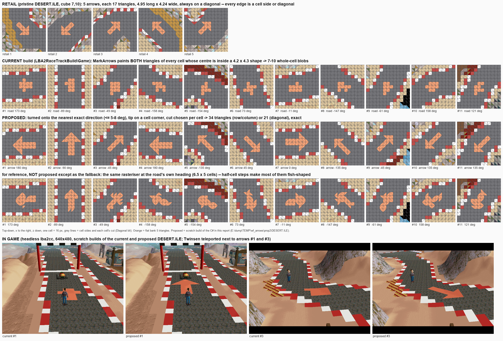

The first arrows were blobs: whole cells painted wherever a cell's centre fell inside a small arrow shape at the road's own angle. The retail arrows are drawn with the ground's own triangles, since each cell is two triangles cut along one diagonal or the other. A retail arrow is 17 orange triangles: a head 2.1 cells long and 4.2 wide on a shaft 1.4 wide, always pointing along a diagonal, so every edge of the arrow is a cell side or a cell diagonal and the triangles draw it exactly.

The track's arrows do the same. Each arrow is turned to the nearest of the eight directions the triangles can draw exactly (at most 5-8 degrees off the road) and placed where the road runs that way, with its tip on a cell corner. Each cell's cut is chosen to fit the arrow's edges (`RasteriseArrow`). The arrows come in two shapes:

- Along a row or column, an arrow is 6 cells long, with a head 2 long and 4 wide on a shaft 2 wide: 24 triangles.
- Along a diagonal, it has the retail head and shaft, 6.4 cells long.

An arrow that would touch anything but plain asphalt is moved along its straight, or left out with a note in the log. Two were left out, both near the road bridge.

**The start line** is one straight column of white cells across the road (`MarkStartLine`): where the road runs within 25 degrees of the cell grid's rows or columns, the line is the column through the cell the start point is in, and the gantry over it and the line laps are counted at are turned onto the grid with it. It used to be the cells within half a cell of the true line, which stepped sideways a cell where the road runs 5 degrees off the grid. The curb blocks either side of it are red, so a white one doesn't run into it. [From above](racetrack/build/start_line_top.png).

**Checked in the engine** (2026-09-28): every arrow of a bridge build (12) and of a jump build (15-16) was photographed standing on it in the game, and all are clean. The engine reads a cell's cut from its first triangle only (TERRAIN.CPP), as the builder and the map assume. A jump build in the "Level viewer" install had broken arrows in the game: its diagonal arrows came out as two arrows pointing opposite ways over each other, and it was just as broken drawn top-down with the engine's rule. It came from an app instance started before the final arrow code, while that code was still being changed: the same build from the current app and from the command line is byte-identical, and clean. Rebuilding from a freshly started app fixes it.

## Fixed cameras

Camera zones (type 1) switch the view to a fixed camera while Twinsen is inside the box. "Forced" ones re-aim it every frame and switch off the view's recentring, which is why the car could drive out of the picture.

With `RemoveTrackCameras` (a tick box), a camera zone is removed from scenes 55-73 if it is switched on when the scene loads and its box reaches within 8.5 cells of the road's centre line. That removes 16 zones:

| Scene | Zones removed |
|---|---|
| 61, the School of Magic plaza | 9 |
| 67, the start area | 2 |
| 57, over the old track's start straight | 2 |
| 60, 62 and 65 | 1 each |

Zones that start switched off are kept: only cutscene scripts switch them on (the ferry's arrival, calling the car), and they need them. Scripts and signs that switch a camera on look it up by number, and do nothing when it is gone. Camera shots of doors and buildings further from the road stay.

## The stand-in, and the actors that stay

Removing an actor leaves references to it in the scripts that stay. Mostly these are in Twinsen's own life script: "if Twinsen is near the shopkeeper and presses Action, talk, then send the shopkeeper's track to @45".

At first those references were pointed at Twinsen himself. In scene 67, every press of Action (which is also how he gets into the car) found him at distance 0 from "the shopkeeper", made him speak, and jumped his own track script to a foreign offset.

They now go to a stand-in actor added to each scene that needs one:

- It is invisible, with no body and no shadow, 20000 below the ground. The engine's `distance()` reads "far away" (32000) when two heights differ by 1500 or more.
- Its life and track scripts are a single `END`, and every jump the kept scripts make into its scripts goes to that `END`.
- A camera told to follow it follows Twinsen instead.

Some actors can't go. Twinsen's own script plays the cutscenes of arriving on and leaving the island: by ferry in the harbour (scenes 59, 60, 65) and by Dino-Fly (scenes 55, 73). It waits on those actors' tracks or points the camera at them. Without them, a normal game got stuck for good on the way to or from the island, and with the stand-in the screen went blank.

So the actors Twinsen's script waits on directly (`l_track_obj(n) == k`) or follows with the camera (`cam_follow(n)`) stay: 10 in five scenes (55: 3; 59: 2; 60: 13, 28, 30, 31; 65: 3, 4, 13; 73: 3). In a new game they are hidden until their cutscenes, except the boat moored in the harbour and a Grobo on its quay (scene 65, 10 cells from the road) and the turtle-calling bell (scene 55, 14 cells from the road). The arrival cutscenes were checked against the original files: Twinsen, the Dino-Fly, the ferry and the cameras end up exactly where they do in the original game.

## A longer jump (proposal)

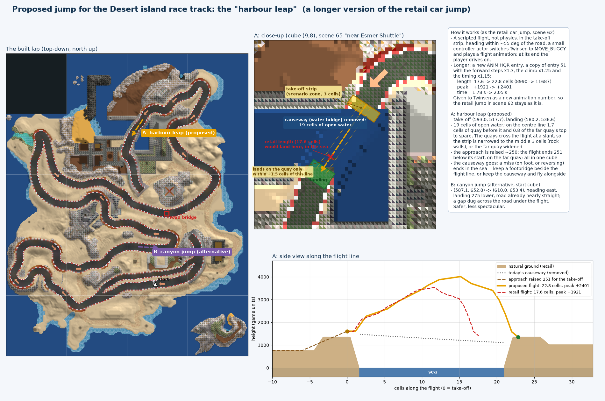

Still a proposal. Its way of making the flight longer, a scaled copy of the retail flight given to Twinsen as an animation of its own, is now built for the jump crossing style (sized to the layout: x1.43 at this track's crossing; see "The jump"); the harbour leap would need a x1.3 copy of its own.

The proposal is the **harbour leap**, in place of the water bridge (scene 65, cube 9,8). The lap crosses 19 cells of open harbour water there, and a jump 1.3 times the retail one clears it:

| | Retail jump | Proposed jump |
|---|---|---|
| Length | 17.6 cells | 22.8 cells |
| Peak | +1921 | +2401 |
| Time | 1.78 s | 2.05 s |

On the centre line it leaves 1.7 cells of quay before the water and 0.8 cells of the far quay's top to spare. The retail length would come down in the sea.

It works exactly like the retail car jump (next section): a take-off strip, a controller actor, and a flight animation. The flight is a new `ANIM.HQR` entry made from entry 51, with the forward steps x1.3, the climb x1.25 and the timing x1.15. Twinsen gets it as a new animation number, so the retail jump in scene 62 stays as it is.

What it needs:

- **A take-off strip narrowed to the middle 3 cells**, with rock walls either side, or a wider far quay. The quays cross the flight line at a slant, so the car only lands on the far quay if it takes off within about 1.5 cells of the centre line.
- **The approach raised by 251.** The flight ends 251 below its start; with the approach raised, that lands on the far quay.
- **A way across for a miss.** The causeway goes, so a miss (on foot, or reversing) ends in the sea. A footbridge beside the flight line, or keeping the causeway and flying alongside it, is part of the proposal.

The alternative, B in the picture, is a dry "canyon" jump on the nearly straight stretch from cell (587, 653) to (610, 653) in the start cube, landing 275 lower, with a gap dug across the road under the flight. It is safer and less spectacular.

[tools/RaceTrackPlan/jumpsite.py](../tools/RaceTrackPlan/jumpsite.py) searched the rest of the lap for stretches straight enough and long enough for a 23-cell flight inside one cube. It leaves out the water bridge itself, the road bridge, the start and the pit ends. It found B, and one other stretch whose landing is 900 above its take-off, which the flight can't reach.

## How the retail jump works (scene 62 "near car jump"; still available as a crossing style)

There is no jumping in the engine's physics. The buggy follows the ground height map, and an object that falls (`FALLING`) only moves straight down. The retail jump is a **scripted flight**:

1. The **hero's own life script** (scene 62, actor 0) checks three things every frame: `IF COMPORTEMENT_HERO == 12` (driving the buggy), `IF ZONE == 1` (Twinsen is in scenario zone 1, the take-off), and `BETA` within about 45 degrees of the zone's direction. `ZONE == 2` with the opposite direction handles the return jump.
2. Then it does `SET_DIR(MOVE_BUGGY)` (movement 12: the object is moved by its animation and its track, not the keys) and `SET_TRACK(label 0)`, and switches to a waiting behaviour.
3. The hero's **track script** label 0 is `ANIM(67); WAIT_ANIM; ANIM(0)`, then `LABEL(1); STOP`. Generic animation 67 of Twinsen is `ANIM.HQR` entry 51: 18 keyframes over 1780 ms, with the "master" bit (no gravity) set on keyframes 1-17. Its root translation adds up to **8990 units forward** (17.6 cells), climbs **1921**, and ends 201 below the start.
4. When the track reaches label 1, the waiting behaviour does `SET_DIR(MOVE_BUGGY_MANUAL)` (13), and the player drives again.

Measured in the engine (headless, `tools/RaceTrackPlan/drive.ps1`): the flight runs along the buggy's heading from the point of entering the zone, 17.4-17.6 cells long, with Y up to about +1920. It lands wherever that is; if the ground there is higher, the car is lifted to it (the retail landing is on a plateau 265 higher, and comes out 7383 units long).

In the retail scene the two plateaus are 4400 to 5200 high with a canyon between them (heights down to 200). Zone 1 is a 4 x 3 cell box on the west plateau's edge, and zone 2 is the same on the east one. The buggy's own script (actor 5) sets game variable 168 while the buggy is in zones 2-5, so the tour garage (scene 57) takes the buggy back when you leave it there.

## The jump (2026-09-28)

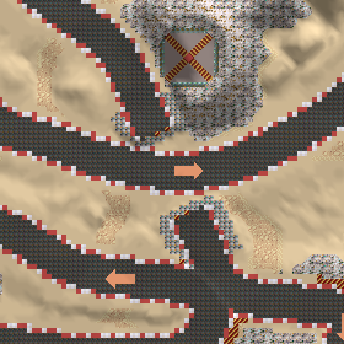

The jump crossing style, like the retail car jump, is a scripted flight (previous section); what is new is the road around it. Before, the road ran on through the crossing as a level junction and the car flew over it, so from the ground the track still crossed itself. Now the jumping road leaves the ground (numbers from the current build, the other road squared up to 90 degrees):

| Along the road, from the crossing | What is there |
|---|---|
| -15.4 to -7.4 cells | **the up ramp**: 800 above the road at its top, 8 cells long, a straight climb with a rounded foot, asphalt and curbs with rock sides; its last cell of flat top is painted with the red/gold hatching |
| -7.4 to -4.4 | **a gap**: sand, level with the other road |
| -4.4 to +4.7 | **the other road** (its curbs, 9 cells across; the two sides are measured separately, since the road bends a little) |
| +4.7 to +7.7 | **a gap** |
| +7.7 to +19.7 | **the down ramp**: 372 above the road at its top (hatched), down to the road over 12 cells |

The very end of each ramp is a face of blocking rock. Each gap is 3 cells (`JumpGap`) past where the jumping road's line actually leaves the other road's curbs, measured on the built road: the other road bends through the crossing, and a gap worked out from the crossing angle alone came out a cell wide on one side. The whole jump sits on a level stretch at the crossing's height, which EqualiseCrossings gave both roads, blended into the road's own profile over the next 15 cells. That matters because the flight knows nothing of the ground: it ends a fixed distance on and a fixed height down from where it starts, so the down ramp must be where the flight ends. `RaceTrackBuilder.PlanJump` does the layout; the ramps get the bridges' narrow rock-sided shoulders (`TrackRoad.Bridge`), the gap is sand (`TrackRoad.Gap`), and no arrow is put on any of it (`TrackRoad.Jump`).

**The crossing angle.** A jump clears the other road more easily the steeper it crosses it, but the crossing is re-shaped: the straighter road is turned and made straight over the whole jump, then bent back to the drawn course. At 64 degrees the stretch beyond the jump ran into the next part of the lap, 4.3 cells between centre lines (two 9-cell roads overlapping), which read as a second crossing. So `JumpAngle` tries 64 degrees down to 36, 2 at a time, and takes the steepest whose re-shaped stretch (the points that moved off the drawn road) keeps `JumpClearance` (12.5 cells) from every other part of the lap. The other road's own arm near the crossing is left out, being the one crossing there should be. On the Desert track that is 42 degrees (41 as built), keeping 13.2 cells, as the bridge build does there. A lap where no angle manages it gets the angle that keeps the most, and a `WARNING` in the log.

**The other road squared up.** At 41 degrees the other road met the up ramp at a slant, and its surface ran into the ramp's right side: 3.1 cells of overlap, where its ground and paint won over the ramp's curb, so the ramp had no red/white curb on that side. `SquareOtherRoad` now turns the other road to meet the jump at 90 degrees over a short stretch: straight for 8 cells either side of the crossing, then back on its own course over 32 cells. It tries 90 degrees down to 60 with blends of 32, 28 and 24 cells, and takes the first that still crosses the lap once, keeps `JumpClearance` from the rest of the lap, and bends no tighter than 6 cells (10.8 here). Its surface now stays 3 cells clear of both ramps, which come out the same either side. Two smaller changes back this up: the ground under a jump ramp's top is shaped after the verges and embankments and before the road surfaces (`ModifyGround`), and a ramp's rock sides win over another road's sand verge in the paint.

**A longer flight.** The retail flight (17.6 cells) would land in the gap. `Terrain/RaceTrackJumpAnim.cs` adds a copy of ANIM.HQR entry 51 as a new entry with its steps scaled, as long as the layout needs: from the take-off strip, over both gaps and the other road, to `JumpLandInto` (3.5) cells down the far ramp. Squared up, that is x1.21 forward, x1.18 up and x1.11 the time: 21.2 cells in about 2 s. It is added after the island is built, since the layout decides its length. It gives the new entry to Twinsen's buggy entity (RESS.HQR entry 44, entity 12: the engine loads entity n for behaviour n, and driving is behaviour 12) as generic animation 200, the one record added to that entity; the retail jump in scene 62 keeps entry 51. The hero's track script plays `anim(200)`.

**Where the flight starts.** The take-off strip (scenario zones numbered 40) starts 2.5 cells before the lip and is 1.25 cells deep, as wide as the curbs. The flight starts where the car enters it, whatever the speed: at full speed the car moves a fifth of a cell a frame. So the flight starts at a known place, 5.5 cells up the ramp, and ends 3.6 cells down the far ramp, 30 units above its surface: the down ramp's height (372) is worked out from that. The strip started 1.5 cells before the lip at first. The jumping road runs diagonally across the ground's grid, so the lip's rock face is a staircase of blocking cells, and a car 3 cells off the centre line hit a step of it before it reached the strip, and stopped.

**Verified in the engine** (headless, `tools/RaceTrackPlan/jumpdrive.py`):
- Driving at full speed from 20 cells before the take-off, on the centre line, the car climbs the ramp and takes off at the strip. It flies over the gaps and the other road, lands on the down ramp, and drives on down it.
- Three and four cells either side of the centre line, the same.
- Both ramps have their red/white curbs along both edges up to the lip (the picture above, and cell by cell along both edges).
- [In the air](racetrack/build/h_jump.png); [from the other road](racetrack/build/h_jump_gap.png) (an earlier build), with the gap and the down ramp's hatched top.

### How the scene runs it

`Terrain/RaceTrackScenes.cs` (`AddJump`) adds a small controller actor instead of editing each scene's long hero script:

- **The controller** (entity 16, invisible, no body) goes in the scene the take-off lies in (scene 66). It makes the retail script's three checks (`zone_obj(0)`, `beta_obj(0)` within 56 degrees of the road, `comportement_hero`), then does `set_dir_obj(0, 12)` and `set_track_obj(0, label_90)`. It gives the keys back when label 91 is reached.
- **The hero's track script** gets `label(90); beta(<heading>); anim(200); wait_anim(); anim(0); label(91); stop();`. The `beta` sets the road's heading first, so the flight goes along the road whatever the car's heading was within the window.
- **The take-off strip** is added at the end of the zone list, so it wins where zones overlap.
- **The crossing**: `RaceTrackBuilder.SteepenCrossing` turns the road to the chosen angle and makes it straight over the whole jump (about 25 cells either side), `SquareOtherRoad` squares the other road up to it, and `PlanJump` lays it out.

## The engine's race-track mode (2026-09-28)

The engine changes a race track needs are in one place, `native/lba2-classic-community/SOURCES/RACEMOD.CPP`, and are on only when the environment names a car setup file (`LBA2_RACETRACK_FILE`). LBA Assembler's Play sets it only when the LBA2 folder it plays has a race track built (`RaceTrackService.HasBackups`). Every other game plays exactly as before: the code paths are the original ones.

With it on:
- **The car stays level on the bridge deck** (BUGGY.CPP `BuggyFloorY`, "The car on the deck"), and the parked car doesn't stay on screen as a ghost when Twinsen gets in (`TakeBuggy`).
- **The car setup**, from the file, replaces the buggy's fixed rates (BUGGY.CPP `RaceSpeed`):
  - a **gearbox**: X shifts up and Z down, on the key's press. Each gear has its own top speed; it can also be automatic (up at a gear's top speed, down below 70 % of the gear below's);
  - the **acceleration**, scaled to the gear as a gearbox does it. The pull goes with the gear ratio and the top speed against it, so a gear whose top speed is the original car's pulls like the original car, and a lower one harder (at most 4 times);
  - above a gear's top speed, just after a shift down, the car slows as it does off the throttle;
  - the **braking**, the **rolling to a stop**, the **top speed backwards** and the **steering**;
  - the engine's sound revs up through each gear.
- **A display** in the top right corner, in the game's font, while Twinsen drives: the gear, the speed, the lap and its time, the checkpoints crossed, the last and best laps, the race position and a message line. Speeds are in km/h with a cell taken as a metre, so the original car's top speed is 27 km/h.
- **Laps are counted** at the start line (from RACETRACK.JSON: its ends in its cube's coordinates, across the lap and the pit lane, and the way a lap crosses it). Crossing it the right way starts lap 1. The timer is the game's own clock (`TimerRefHR`).
- **Checkpoints.** A lap used to count at every forward crossing of the line, so a car could reverse over it and cross it again. Now there are 8 checkpoints round the lap: lines across the road (and its verges), each within one cube, put by `RaceTrackBuilder.PlaceCheckpoints` evenly along the lap, away from the pit lane, the crossing and the cube edges. A lap counts when the car has crossed them all in order and then the start line; the display shows the last lap's time and the best. Crossing the start line short of them shows "Missed checkpoint N: no lap", and the lap's time runs on. Crossing the last one backwards takes it off again and shows "Wrong way".
- **An opponent.** The retail Desert track's racer (scene 57's actor 4: entity 157, body 227, the car with its driver) is copied into every outside scene of the island. The copies are hidden below the ground, except the one on the grid beside the buggy in scene 67. The engine drives it along a racing line the builder plans with the track, at speeds planned from the player's own car (see "The opponents' driving"). Over the jump it follows the flight's own arc. It sets off when the player first drives off, and waits while Twinsen is out of the car. Each frame it is placed, facing along its line and running its driving animation, in whichever scene is showing (`RaceMod_Frame`, at the start of the frame's drawing). The display shows the race position: how far round each car is. While it moves, the whole scene is redrawn each frame. Without that, the car, drawn into the engine's background copy while it waited on the grid, stayed there as a picture once it set off.
- **Play starts the race.** With "Start beside the car on the start/finish straight" in the car setup (the default), Play on a folder with a race track built starts scene 67 whatever scene is open (`RACETRACK.JSON`'s `StartScene`). Twinsen stands beside his buggy on pole, with the opponents on the grid behind him (see "The grid, qualifying and the count-down"), and the zones and routes the editor draws over the game are hidden; changing those checkboxes while playing shows them again. The build removes the outside scenes' other actors already. The scene's hero start keeps no facing, and Twinsen comes in facing the lap's way, so he stands 1.8 cells behind the car, where Action gets him straight in.

- **Two opponents.** Baldino races too, in his rocket car, on a line of his own (see "Baldino's rocket car"). The engine drives up to four, each with its own line, grid spot, skill, character and cars; the display's position counts them all ("Position 2/3").

The file is `key=value` lines: `gears`, `gear1`..`gear8` (top speeds, world units a second), `accel`, `brake`, `coast` (speed gained or lost per millisecond; the original car's are 4, 12 and 7), `reverse`, `steer` (4096ths of a turn a second; the original 1024), `automatic`, `hud`, `startline=<cube x> <cube z> <x0> <z0> <x1> <z1> <dir x> <dir z>`, a `checkpoint=` line in the same form for each checkpoint in order, and for the opponent `opponent_path=<file>` (lines of `x z y speed radius`, island world units, 32768 a cube: with the bend radius the speeds are planned from the car, without it the file's are driven), `opponent_grid=<the line's point it starts at>`, `opponent_pace=<percent>` (its skill), `opponent_top=` and `opponent_grip=<percent>` (its character), `opponent_catchup=<percent>` `opponent_name=`, and an `opponent_actor=<scene> <actor>` line for each scene's copy; the second opponent's lines are `opponent2_path` and so on, up to `opponent4`. The grid is `grid=<cube x> <cube z> <x> <y> <z> <turn>` lines, pole first, `qualifying=1` (or 0), `qualifying_seed=<n>` (optional: the opponents' qualifying times' randomness, else the clock) and `hide_actor=<scene> <actor>` for the cars of opponents the player left out. Anything missing keeps the original car's value; with no `checkpoint=` lines every crossing of the line counts, and with no opponent lines there is no opponent. X is otherwise the dodge key, which does nothing while driving.

**The race car setup** (`RaceCarWindow.cs`, `RaceCarSetup.cs`, kept in the settings): presets (the original buggy, a 5-gear race car, a fast 6-gear one), the number of gears and each one's top speed in km/h, the acceleration, braking, rolling to a stop and steering as percentages of the original car, the opponents (each on or off, with its skill, 50-120 %, and whether they push harder when they fall behind), and the race start. It appears when Play starts on a folder with a race track (it can be switched off there; it doesn't appear when the game is only restarted), and from the race track dialog's "Race car setup…" button. Play writes it for the engine as `racecar.txt` in its user folder, with the opponents' lines beside it as `racepath.txt` and `racepath2.txt` (`Terrain/RaceCarEngineFile.cs`).

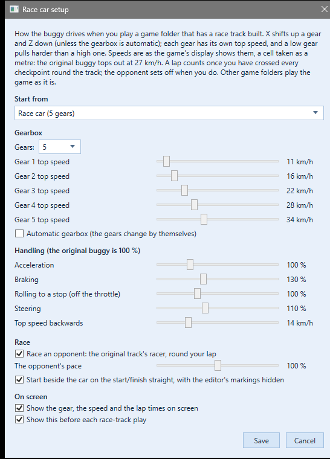

**Verified**:
- Headless, with no car file, the car tops out at 3800 as ever.
- With a 3-gear car (1500/2500/3500), first gear holds at 1500, and each X press lifts the top speed to the next gear's.
- The display shows the gear and the speed. The first crossing of the start line starts lap 1; the car taken back and across again shows lap 2, and the last and best times.
- In the app: Play on the built folder showed the car setup, then the game with the display; the car file had the start line from RACETRACK.JSON. Play on the same folder restored showed neither.
- Checkpoints (headless, a test file with two checkpoints in the start cube): crossing one counts it (1/2); reversing over it shows "Wrong way" and takes it off (0/2); recrossing the start line then shows "Missed checkpoint 1: no lap" and lap 1's time runs on. With both crossed in order, the next crossing counts lap 2, with the last and best times. The built lap's 8 checkpoints are crossed once each, in order and the lap's way, by the opponent's line (both styles).
- The opponent (headless, jump and bridge builds): on the grid beside the buggy, it sets off with the player and runs ahead, and nothing is left behind on the grid. On the bridge build its line runs over the deck at the deck's height and under it on the lower road.
- In the app (2026-09-28): with scene 61 open, Play showed the car setup, then started scene 67 with Twinsen beside his car, the opponent on the grid and no zones or routes drawn. The car file it wrote matched the one tested headless.

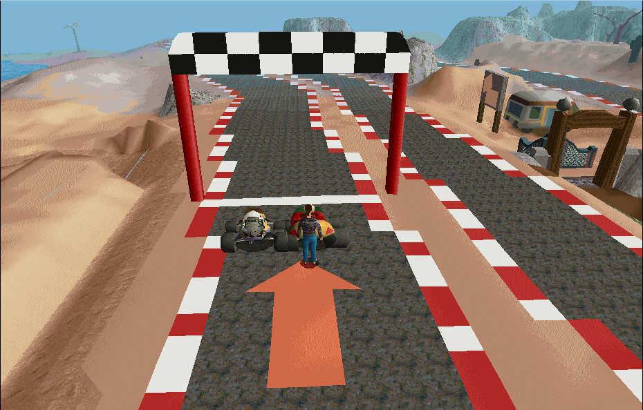

## The grid, qualifying and the count-down (2026-09-28)

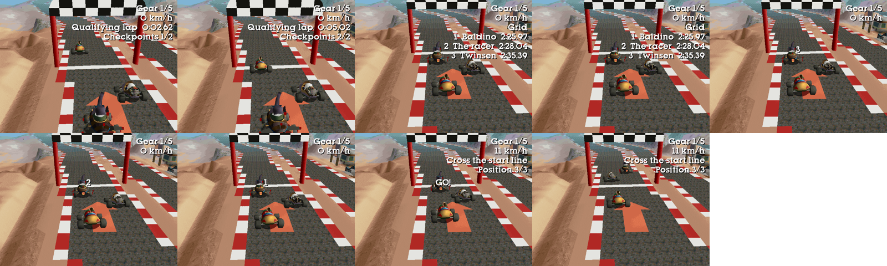

**The grid** (`RaceTrackScenes.GridSpot`) has five spots in scene 67, staggered either side of the middle of the road:
- Pole is 3 cells behind the start line; each spot is 3.5 cells behind the one before it and 1.75 cells to its side.
- Two cars side by side are 3.5 cells apart across the road (the cars are 2.6 cells wide, so 0.9 cells between them), and 7 cells apart on the same side. Before, the racer's car stood touching the player's.
- The build puts Twinsen's buggy on pole, with Twinsen 1.8 cells behind it (where Action gets him in; the next car is on the other side, clear of him), the racer on the second spot and Baldino on the third.
- The spots are written to RACETRACK.JSON (`Grid`) and passed to the engine.

**The pits** (`RaceTrackBuilder.PlacePits`) are where the opponents' cars wait while Twinsen qualifies: five spots in the pit lane, the first 2 cells before the start line and each 4 cells further back, 10.5 cells to the side of the lap (the road's curb is 4.5 from its middle, so they stand well clear of it) and facing the way a car leaves the pits. On the grid they stood across the start line, which a qualifying lap has to cross. The build parks the cars there, so they are out of the way in the retail engine too; the spots go to RACETRACK.JSON (`Pits`) and the car file (`pit=`). The pit lane is its own road whose points may run either way round the lap, so a spot is found by where it lies along the lap, not by counting points along the lane.

**Qualifying** (`RACEMOD.CPP`, the car setup's "Drive a qualifying lap first", on by default):
1. While Twinsen qualifies, the opponents wait in the pits. The display says "Qualifying: cross the start line", then "Qualifying lap" with its time and the checkpoints.
2. His first complete lap (every checkpoint, in order) is his qualifying time.
3. Each opponent's time is its lap as the engine planned it at its skill, plus or minus up to 3 s at random.
4. Everyone is sorted by time and put on the grid, pole first: the opponents move from the pits onto their spots. Twinsen's car is moved to its spot (only ever in scene 67, where his lap has just ended), standing, and the camera follows it. The display lists the grid ("1 Baldino 2:25.97 ...") for 4 s.

Without qualifying, the grid is formed as soon as Twinsen is in his car, with him on pole and the opponents behind in order of their times.

**The count-down** follows: a big 3, 2 and 1 in red, a second each, then a green GO!, drawn in blocks in the middle of the screen (`BigText`). Twinsen's car can't move until GO (`RaceMod_Held`, BUGGY.CPP `RaceSpeed`). At GO the laps start afresh from the start line, and the opponents pull away from a standstill:
- An opponent's speed rises no faster than the car's pull through its gears allows, up to its line's speed.
- It moves from its grid spot onto its racing line over its first 12 cells. The lines are no longer held at the grid.

**Verified** (headless, the jump build):
- **Without qualifying:** the grid formed with Twinsen on pole. The throttle was held from 2.8 s, but his car stayed on its spot until GO at 6.1 s. The count-down showed and all three cars set off at GO.
- **Qualifying:** a test car file puts two checkpoints just past the start line, the second crossed backwards, so a lap can be completed without steering. Twinsen's 155.39 s lap put him third behind Baldino's 145.97 s and the racer's 148.05 s. His car was moved to the third spot, the grid was listed, then 3, 2, 1, GO.
- **The pits:** during qualifying the start/finish straight is clear, and a state dump puts both opponents exactly on the first two pit spots (0.9 and 4.9 cells before the line, 12 cells to its side). When the grid forms they move onto grid spots 2 and 3, to the centimetre. In the app, Play shows Twinsen alone on the straight with the two cars waiting in the pit lane.
- **In the app:** the menu build is byte-identical to the command-line build. Play started on the staggered grid, and the car file had the grid, qualifying and the opponents' names.

## The opponents' driving (2026-09-28)

The racer's line (red above) and Baldino's (blue), at the north-west hairpin, the two bends at (625, 643) and (653, 480), the jump and the start.

**The racing line** (`RaceTrackBuilder.PlanRacePath`) has a point a cell apart round the lap. Each point may sit up to 3.2 cells either side of the middle of the road (the car's middle: its wheels then just reach the curb). On the inside of a bend it stays far enough from the bend's centre to keep a radius of 1.2 cells at least: the lap's tightest bends are 2.6 cells round the middle of the road, and a line cutting further in folded over itself there. The line is found in two steps:

1. **Smoothing.** Each point is moved to the middle of its neighbours and then back within the road, over windows from 30 cells down to 2, 100 rounds each. A long bend's line moves as a whole. Point-by-point curvature sweeps, tried first, only ironed out small wiggles in 6000 rounds; they left the line on the middle of the road.
2. **Local search.** A search on the lap time itself: points every 4 cells are moved in and out by 1, 0.5, 0.25 and 0.1 cells, and a move is kept when the lap is quicker.

Each opponent leans a little to its own side, so the two lines don't lie on each other on the straights. Its grid spot and the start line are held at its side, so it starts where the scene puts its car. On the Desert track, with the race car driven perfectly, the line takes 134.4 s against 145.0 s on the middle of the road; the old line took 163.2 s.

**The speeds** are planned by the engine when the race starts (`RACEMOD.CPP` `PlanSpeeds`), from the player's own car as the car setup makes it:
- **Bends:** the buggy turns at a fixed rate whatever its speed (its steering, `SpeedRot` a second, BUGGY.CPP), so a bend of radius R is taken at up to that rate times R. The path file carries each point's bend radius (the circle through the points three cells either side).
- **Straights:** no faster than the car's top gear.
- **Braking and accelerating:** braking before bends as hard as the car's brakes, pulling away after them as hard as its gears (the pull of the gear an automatic gearbox would be in), two rounds each way round the loop.
- **Skill:** the speeds are driven at the opponent's skill, the car setup's slider. At 100 % it drives the player's car perfectly on its line, faster than anyone can. The defaults are 92 % for the racer and 91 % for Baldino: laps of 146.1 s and 145.0 s. A player driving the middle of the road perfectly takes 145 s.
- **Character:** Baldino drives with 102 % of the car's top speed and pull but 92 % of its cornering. His perfect lap is 132.0 s, the racer's 134.4 s.
- **Catch-up:** an opponent that has fallen behind the player pushes harder, up to 8 % more at 60 cells behind. It never slows down when ahead. This is a car setup checkbox, on by default.

Because the speeds come from the player's car, a faster car setup (the 6-gear preset, say) makes the opponents faster too.

**Verified:**
- **Headless:** the engine planned the perfect laps above. With Twinsen sitting in his car at the start, the opponents lapped in 146.09 s and 145.01 s, lap after lap. The engine logs each opponent's lap (`[racemod] opponent 1: lap 1 in 146.09 s`).
- **The lines:** they stay within the road everywhere; in the picture above, they use the curbs round every bend. On the bridge build they run over the deck at its height and under it on the lower road.
- **In the app:** the menu build is byte-identical to the command-line build. Play wrote the skills, characters and catch-up into the car file, and the engine planned from them.

## Baldino's rocket car (2026-09-28)

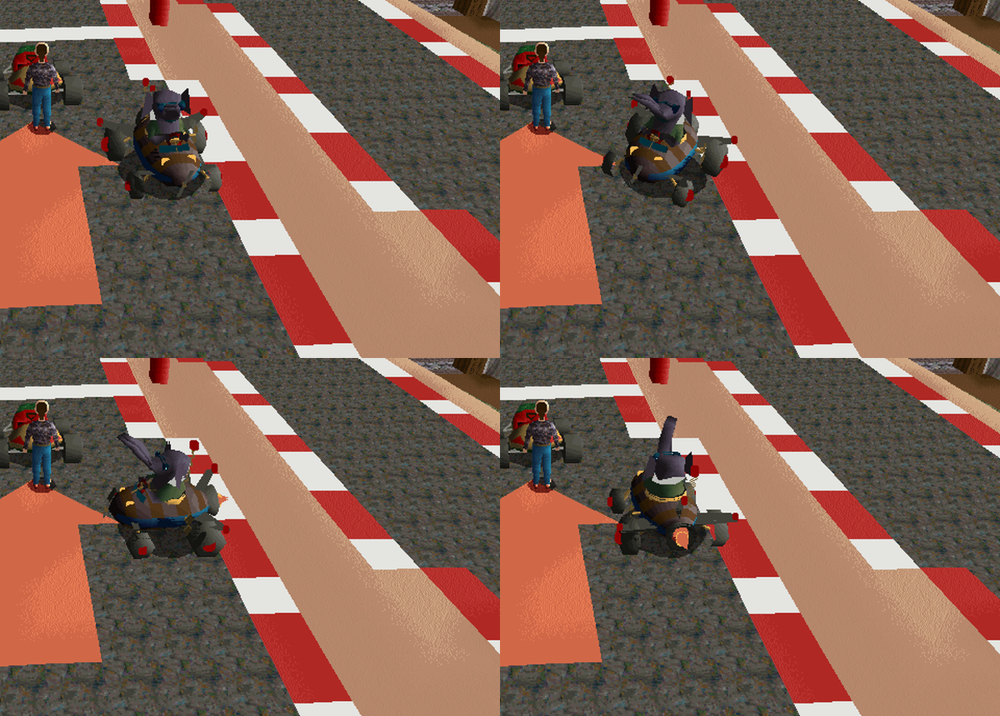

A second opponent: Jerome Baldino, the Desert island's inventor, in a car made after his rocket ship (`Terrain/RaceTrackBaldinoCar.cs`). It isn't a copy of the ship but an inventor's version of it, about the size of the game's own cars (2.6 cells long, 2.3 wide):

- **The hull** is a stubby ribbed barrel, the ship's planked fuselage in alternating brown and taupe planks, with navy go-faster stripes down both sides.
- **The cockpit is open**, so his face shows: an oval hole with a brass rim, a low teal windscreen, and a red steering wheel he holds out in front of him (his elephant's head reaches forward, so the wheel is below his chin).
- **At the back**, a grey rocket nozzle with an orange flame (drawn unlit, so it glows), the ship's swept grey wings with red lights at their tips (its red discs), and a tail fin with another.
- **The gadgets**: odd wheels (big at the back, small at the front) with red hub caps, a coil-spring aerial with a red ball, a clockwork key in the side, a propeller on the nose and two yellow headlights.
- **Baldino himself** comes from his own body (BODY.HQR entry 139, "Jerome Baldino"): his torso, head with sunglasses, ears and arms. His hips and legs are left out (they are in the car), he is made a little smaller (0.8) and his arms are posed on the wheel (a two-bone reach that keeps his arm lengths). His trunk is raised forward and to one side, as if trumpeting: hanging, it went through the dashboard, and straight up it hid his face.

**How it moves.** The car is a second body of the retail racer's entity (157: its own car is body 0, BODY.HQR 227; this one is body 1), so the racer's animations drive it. It has the same 18 bones for the same parts:
- 0-1: the root and the bounce;
- 2: the hull;
- 3-8: the front struts, hubs and wheels;
- 9-12: the rear axles and wheels;
- 13: the driver.

The racer's driving animation bounces the car, tilts it a degree, wobbles the wheels and leans the driver. It also swings the racer's arms (bones 14-17) a long way onto his wheel; Baldino's arms are drawn on his wheel already, in bone 13, and 14-17 are empty.

**What the build does** (`RaceTrackService.Finish`):
- It adds the body to the end of BODY.HQR (entry 469 of the original file: 415 polygons, 11 lines, 16 spheres, 443 points, inside the engine's 550).
- It adds a body record, `1, 1, 4, <entry>, 0`, to entity 157 in RESS.HQR entry 44 (`RaceTrackBaldinoCar.WithBody`, as the jump's `WithAnim` does for its animation).
- It puts a copy of the racer's actor with body 1 in every outside scene, hidden below the ground, except the one on the grid in scene 67 (the third spot until the qualifying decides).
- It writes his line to RACETRACK.JSON (`Rivals`).

BODY.HQR is kept as `BODY.HQR.before-racetrack` with the others. The body writer (`Body.Write`) now keeps a face whose `Material` is 0 flat and unlit in a lit body (the flame, the cockpit's dark hole). Every retail body still reads back after a write (`BodyPipeline bodyroundtrip`).

**His line** (`RaceTrackBuilder.PlanRacePath` with `BaldinoLine`) keeps more to the other side of the road from the racer's. His rocket car (his character) drives with 102 % of the player's car's top speed and pull but 92 % of its cornering. Over the jump it follows the flight like the racer's. The car setup has "Race Baldino too" and his own skill.

**Verified**:
- In the engine (headless): the car on the grid, and seen from the front, three-quarters, the side and the back (the scene's copy turned with `ScriptRoundTrip actorbeta`, played without the race-track mode, which turns the cars along their lines every frame). With the race on, both opponents set off with the player and the display counts three racers.
- His line crosses the 8 checkpoints once each, in order and the lap's way, on the jump and the bridge builds. On the bridge build it runs over the deck at its height and under it on the lower road.
- The menu build (jump) is byte-identical to the command-line build, BODY.HQR included. Play from the app started the race with both cars on the grid, and the car file it wrote had both opponents.

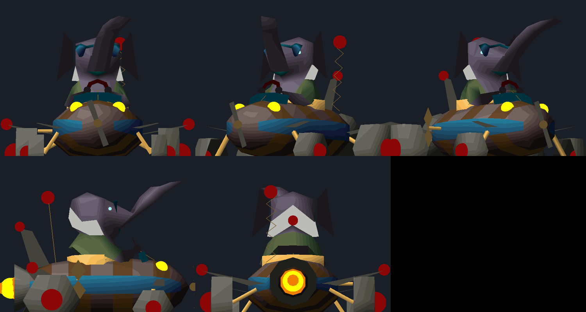

`ScriptRoundTrip baldinocar <game> <scratch>` builds the car into copies of a folder's BODY.HQR and RESS.HQR; `BodyPipeline object 2 <scratch>\BODY.HQR 469 <turn> <png>` draws it. `BodyPipeline bodyinfo <file.hqr> <entry>` lists a body's bones, `animdump <file.hqr> <entry>` an animation's keyframes, `palettesheet 2 <png>` the body palette.

## Citadel Island's town circuit (2026-09-29)

A second track, from the user's own drawing over a top-down picture of Citadel Island: a 1,046-cell town circuit through the harbour, the citadel's streets and the cliffs, with a pit lane down the west side and a bridge where the lap crosses itself. Everything the Desert track learned is reused: the same road, curbs, arrows and hatching, the same grid, qualifying, count-down, opponents and racing lines.

**The route came off the picture.** The picture is the island's own map turned a quarter turn clockwise and squashed, so the drawing was fitted to a fresh render of `CITADEL.ILE` rather than measured by hand:
- the land of both was masked (the sea, and the drawn lines) and the best scale and offset found by cross-correlation: 0.805 across and 0.595 down, an island cell being 4 pixels of the render. The outline it gives follows the coast in the drawing exactly.
- The lime route was skeletonised and walked with a "snake": a cursor that steps a few pixels along and snaps back to the line. A plain walk of the skeleton turned back on itself where the route crosses, and closed a loop covering only part of the track; the snake carries straight on through a crossing. It closed on the whole 1,071-cell lap.
- The pink bridge bar is drawn over the lime and cuts it, so the route mask is the lime and the pink together.
- The orange pit lane's two ends and the bridge's middle came from their own masks.
`docs/racetrack/citadel_track_plan.json` is the result (the plan format the Desert track uses: points in island cells, and the pit lane's ends). `ScriptRoundTrip planprobe CITADEL <plan>` checked every point is on land before anything was built.

**What differs between islands** is now a record, `Terrain/RaceTrackIsland.cs`: the ground and decor files, the island byte, its outside scenes, its palette, the plan built into the program, and whether there is a retail race track to clear. The dialog has an island to choose, and the command line takes `RT_ISLAND`.

- **The road's look** (`Terrain/RaceTrackTextures.cs`). The Desert track's asphalt, hatching, rock and white curb are tiles of the *Desert island's* own 256 x 256 texture page, and its red curb and arrows are colours of its own palette; on Citadel those coordinates draw whatever happens to be there. The build now copies those four tiles into the target island's spare texture space -- the 8 x 8 blocks no cube's polygon reads, 14 % of Citadel's page -- and remaps every pixel to the nearest colour of that island's palette. The flat colours are matched the same way, keeping each colour's position in its ramp so the engine's light still lands on it (red curb 69, arrows 101 on Citadel).
- **The buggy.** Citadel has none: the buggy is one object the game puts on the Desert island. The build copies the buggy actor out of Desert scene 67 into the start scene, with the same script, and takes the car quest out of it so it is there from the start of any game (a copy added after that patch had already run kept the quest test and removed itself, which is why Twinsen first stood on the grid with no car).
- **One bridge over two crossings.** The drawing has the lap cross itself twice a few cells apart, with one pink bridge over both: a loop that dips under the same stretch of road twice. The bridge planner used to take the first crossing and give the deck to whichever road was straighter there, which picked a different road at each crossing and carried neither. It now takes the crossings within a deck's length of each other as one span, chooses the side of the first crossing that the others also lie on, centres the deck between them, makes it long enough for all of them and high enough over the highest road it passes above (73 cells of deck here, against 68 for the Desert track's one crossing).
- **Read-only files.** A game folder taken off a disc (or from a reference set kept read-only) has read-only files, and File.Copy carries that to the copy, so the build failed on its own backup; every copy the build makes is now cleared.

**The track**: 1,046 cells, 19,033 ground points levelled, 12,481 cells painted, 96 props and 85 solid decors taken off the road, 10 arrows, a 98-cell pit lane, 8 checkpoints, a grid of 5 and the pits beside the start line. With the race car driven perfectly a lap is 102.6 s (the racer's line) against 111.8 s round the middle of the road -- a shorter, twistier circuit than the Desert track's 134 s.

**Verified**:
- The menu build is byte-identical to the command-line build (all seven files), and only Citadel's own files are kept and changed: the Desert island's are untouched.
- The Desert track, built again with all of this in place, is byte-identical to its last build (`DESERT.ILE`, `SCENE.HQR`, `RACETRACK.JSON`), for the jump and the bridge alike.
- In the engine (headless): the start scene (49, near the Dino-Fly) puts Twinsen beside his buggy on the grid, Action gets him in, the display says "Qualifying: cross the start line", he crosses it and the lap times run with the checkpoints. The opponents wait in the pit lane.
- In the app: Play starts scene 49 with the car and the opponents in the pits.
- Citadel's own rain and gloom make the track look dark: a screenshot of the untouched scene 49 is darker still (mean brightness 43 against 59), so that is the island, not the build.

### Second round: the invisible walls, the leftovers, the bridge and the rain (2026-09-29)

The first Citadel build could not be driven round. Five separate faults, four of them Desert assumptions that only showed on a second island:

**The invisible walls were the cube edges.** An island's outside is one scene per cube, and the engine holds the hero at a cube's edge (`EXTFUNC.CPP`: the position is clamped and `FlagHeroOut` set) unless a cube-change zone (type 0) to the next cube's scene covers that spot, at his height, on that edge (`GereZoneChangeCube`; the zone's arrival value, 512 or 32768 - 1024, names the edge). The build removes door zones that lie on the road, and it told a door from an edge crossing by the scene it leads to -- hard-coded as the Desert's outside scenes, 55-73. On Citadel every edge crossing leads to 42-50, so all of them were removed: 29 zones, a wall at every cube edge. Now the island's own range decides (`RaceTrackIsland.FirstScene/LastScene`), and only the 9 real doors go (into the sewer, Tralu, the ticket office...).

That alone was not enough: the retail edge zones only span the edges where the retail paths cross them (scene 42's south edge into 49 has none for 14 cells, where a cliff was). So the build now finds every place the lap crosses a cube edge (`RaceTrackScenes.EdgeCrossings`) and, both ways, adds a crossing zone of its own wherever the island's don't cover the whole road's width at the road's height (`CoverEdges`: the last cell before the edge, 16 cells of it, the position and height carried over like the retail ones). Citadel's lap crosses 14 edges and needed 9 zones; the Desert's crosses 26 and needed 14 -- it too had stretches of edge its racing line crossed fine but the road's full width didn't.

**The remains of a building were the start gantry and some protected bodies.** Body numbers are an island's own. The gantry is placed as bodies 64-66 (the Desert track's beam and posts) and the viaduct's arch as 68-70; on Citadel 64 and 65 are a building's stone wall and pillar, so the "gantry" stood at the start line as a wall and a pillar. And the retail track's bodies (64-71) were protected from removal -- on every island, so Citadel's walls and pillars on the road stayed. Now the protection only applies on the island that has the retail track, and for any other island the build copies the Desert's gantry and arch bodies into its own OBL (`RaceTrackService.CopyRetailBodies`, as they are: the palettes put the same colours at those indices) and places the copies (`RaceTrackOptions.RetailBodies`).

A third kind of leftover: a building is several decor pieces placed apart, and clearing the pieces on the road left the rest standing -- a wall on its own by the kerb, a roof beam in mid-air whose supports had gone. `ClearRuins` treats pieces whose boxes touch as one structure, and where one lost pieces to the road and what is left is all small parts (no whole building among them), those go too, within 14 cells of the road. It took 6 pieces on Citadel and 3 on the Desert (two lone fence posts and a small low piece).

**The bridge didn't meet the road.** The deck is straight, so the road it carries is straightened first (`SteepenCrossing`). With one deck over two crossings, the straightening still picked its road by the old one-crossing rule (the straighter one) -- the other road -- while the deck went on the stretch the two crossings share: the deck sat on a road that had never been straightened. Now a multi-crossing span straightens the road it carries, through all its crossings, along that road's own heading (`SpanOf` gives the span's middle and length to both steps). The build reports how far the road's middle strays from the deck's: 0.0 cells along the whole deck, where anything over 1.5 is a warning.

**The road ran off the island.** Driving over the bridge, the car went through scene 94, the engine's open sea: the deck's far end reached the corner of cube (7,8), which Citadel hasn't got. The drawn route itself passes 2 cells from that corner, and the road is 6 cells wide each side. `KeepOnIsland` now moves the lap's middle smoothly away from any missing cube until its verge clears it by half a cell (on Citadel from 2.2 to 6.8 cells; the Desert's lap never comes near one), and the bridge's straight is moved sideways, staying straight, until all of it clears too (6 cells here, so the deck stands 6 cells east of the drawing's pink bar).

**The rain.** The storm is the engine's `TEMPETE_ACTIVE` (COMMON.H): chapter below 2, which is how the story stands until the lighthouse keeper is freed and the aliens land. Once it is over the engine does more than stop the rain -- it loads Citadel Island from a different file, `CITABAU.ILE` ("citadelle beau"), with its own light, palette (RESS 42 against 27) and decor bodies (`CITABAU.OBL`), and a clear sky. So:
- the track is built into both files (`RaceTrackIsland.TwinIleFile/TwinOblFile`, `RaceTrackService.BuildTwin`): the same ground, so the same road, with the twin's own texture import, decor clearing, gantry and deck bodies. Without it the track would vanish in a real game once the lighthouse quest is done.
- the race car setup has "Stop the rain on Citadel Island" (on by default), which writes `weather=fine` to the car file; the engine's storm macros then read `RaceMod_FineWeather()` as well as the chapter. Only the weather changes, not the story: the scripts that test the chapter or the lighthouse quest (variable 56 turns Twinsen back at scene 49's edge in one of its states) are left as they are.

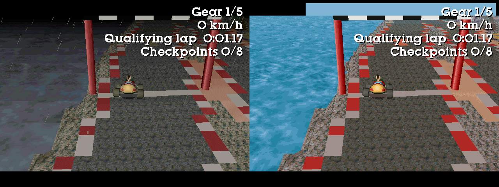

**Verified**:
- Every place the lap crosses a cube edge, both ways, walked in the engine (a script puts Twinsen a few cells before the edge on the racing line and walks him over): all 28 Citadel crossings and all 48 Desert ones end in the right scene. (Loading scene 48 directly starts Twinsen inside its scenario zone 7, which plays its scripted arrival from the sewer grid and holds him, so its departures were walked after arriving from scene 47, as a car does.)
- The bridge in the engine: the car started on the straight before the deck and driven straight across held the deck's height (3501) the whole length, within 0.3 cells of its middle, and went on into scene 48 without passing through the open sea.
- `weather=fine`: the engine loads the fine-weather island (mean brightness at the start 99 against 64), no rain, the sky and sea clear, the track, gantry and grid all there.
- The fine-weather file built from the same plan has the same lap, start line, pits and checkpoints; the heights of the two files are identical.
- The menu build is byte-identical to the command-line build (all nine files), and keeps backups of CITABAU's two files as well as CITADEL's.
- In the app: Tools > LBA2: race track opens on the island the folder was built with; Play shows the car setup with the rain option and starts scene 49 in fine weather with the real gantry.

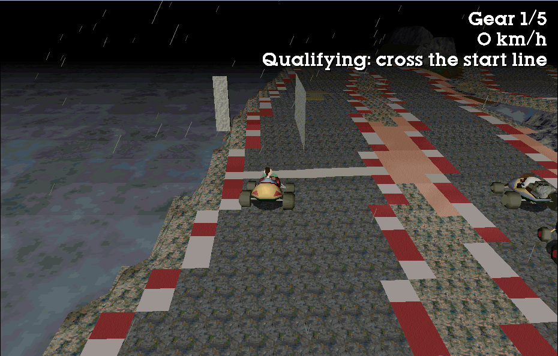

**Known limitations**:
- One track at a time. `RACETRACK.JSON` describes the last one built, and Play races that one; building Citadel's leaves the Desert island's ground as it was but stops the game racing it.
- The lap's tightest turn is 1.5 cells round the middle of the road (the Desert track's is 2.6), at the hairpin above the harbour.

## The story, the holomap, the gloves and the biker (2026-09-29)

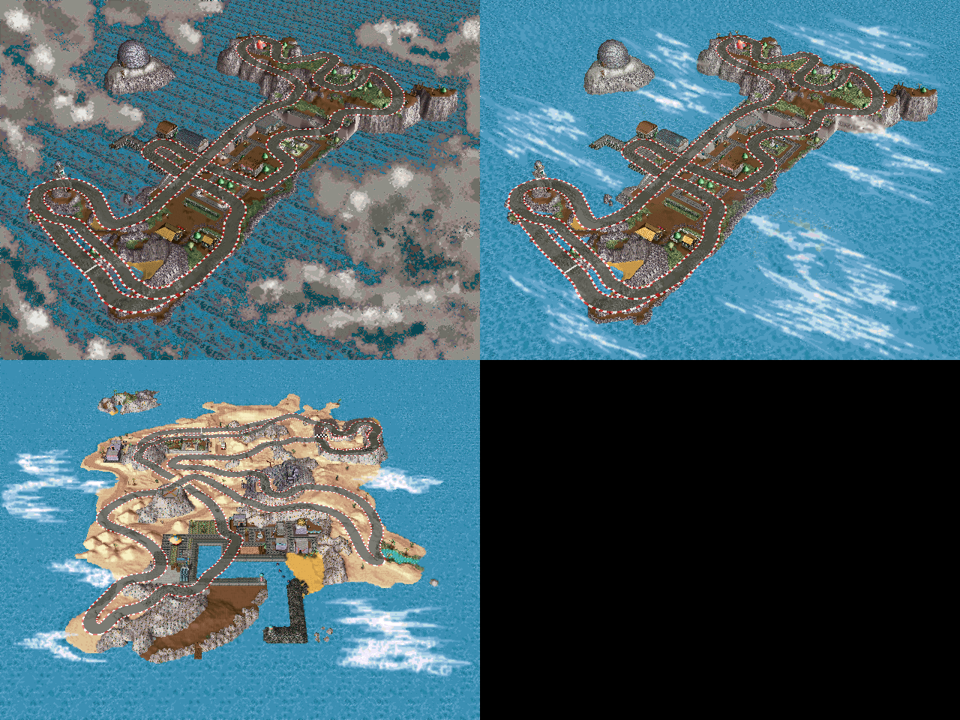

**The holomap pictures** (`Terrain/RaceTrackHolomap.cs`). When the holomap zooms in on an island it shows a pre-rendered 640 x 480 picture of it -- HOLOMAP.HQR entry 18 + 2 x island, in the game's palette (RESS.HQR entry 0) -- and draws the arrows and Twinsen over it through a camera the next entry gives: the island's target point, two angles and a distance (HOLOPLAN.CPP InitHoloPlan, `SetProjection(320, 240, 1024, 700, 700)`, `SetFollowCamera`). That camera is reproduced exactly (LIB386's `InitMatrixStdF`, `LongWorldRotatePoint` -- a rotation only, the camera being the rotated target pushed back by the distance -- and `LongProjectPoint3D`); projecting the island's own heights lands on the island in each picture, islets included. The built road is drawn through it: asphalt taking its shade from the picture's own light, red and white curbs every 1.6 cells as on the ground, the start line, all hidden where the built ground stands between it and the camera (a depth buffer of every ground triangle), and the bridge deck drawn after the roads it passes over. Citadel Island has two pictures, the storm's (18) and, once it is over, its own slot 12's (42); the Desert island's is 22. The retail Desert picture's own little race track sits under the new one but for a few pixels of its gantry.

**Zoe's line** (`Terrain/RaceTrackStory.cs`, Citadel Island only). The game opens with Zoe walking up to Twinsen in their house (scene 0, actor 4) to say text 0 of Citadel's texts -- "rush to the downtown pharmacy" -- and switch on the pharmacy's holomap arrow (`set_holo_pos(22)`). Her walk stays; she says a new text instead: "Twinsen, the new race track is finally built, head to the start line behind the house to qualify. Don't forget your racing gloves.", in all six languages the game has (English, French, German, Spanish, Italian, Portuguese; code page 850, as the game's own texts). TEXT.HQR's language files are 15 per language, each an id list and a table of offsets and texts (an attribute byte, the characters, a 0: MESSAGE.CPP); the CD version speaks a text by its place in the list, so a new text goes at the end, past the last recorded voice, and is shown, not spoken (`Speak`: `num >= MaxVoice`). Her later reminder ("did you find something to cure the Dino-Fly?") keeps the pharmacy's arrow.

**The arrow.** Holomap positions are scene numbers: record 50 + n of HOLOMAP.HQR entry 12 is where scene n lies on its island, used for its arrow and for "Twinsen is here" when he is inside it. The game has 222 scenes and every number 0-99 is one, so the start line's arrow is position 222 -- no scene's, no script's, and the island view's arrow loop runs to 254. Its label is a new text in the holomap's text file (2): "Race track start line.". The race-track mode clears it once Twinsen is at the wheel (`holo_arrow=` in the car file). Fixed in the engine on the way: the arrows' spin was only set up for positions below 100, and the game's own 104-188 started still. The engine's `dumpstate` now lists the arrows switched on (`holo_active`): a new game shows `[22]` after Zoe's line on the untouched data and `[222]` on the mod's.

**The racing gloves.** The darts lie on a shelf in Twinsen's attic (scene 1, actor 8, entity 18 -- BODY.HQR 31); Action in zone 5 there gives them (`found_object(2)`). The inventory is 40 fixed slots, and all 40 are the game's: a save stores exactly 40, item n's count is game variable n, and variable 40 is already the Dino-Fly quest. The darts' own slot won't do either -- the shop sells them (scene 14, 4 kashes, `found_object(2); set_var_game(2, 3)`), and scene 36 and the Desert island's scene 67 give them too. So the gloves take slot 7, the part Baldino gives Twinsen for Zoe to mend the car: the mod has the buggy ready from the start, so the part has nothing left to do.
- Their model (`Terrain/RaceTrackGloves.cs`): a pair of driving gloves built from boxes on one bone -- lit racing red, white cuff bands and a white stripe down the back of each hand, dark palms and fingertips in flat colours (a lit grey ramp came out mid-grey). Standing, fingers up, backs forward, at the size of the game's own glove (OBJFIX 11) as OBJFIX.HQR 7, the model the inventory and the "you have found" screen turn; and lying flat at the darts' size as a new body of the darts' entity (body 1), so the pair lies on the attic's shelf.
- Their texts: slot 7's found message, name and description (file 2: 7, 107, 207) are the narrator's (EN_GAM.VOX has them), so each old text keeps its place in the file under an id nothing asks for (60000 + id) -- every text after it keeps its voice -- and the gloves' texts go at the end, unvoiced: "You have found a pair of racing gloves.", "Racing gloves", "Your racing gloves: a firm grip on the buggy's steering wheel, lap after lap." (six languages).
- The attic: the shelf shows the gloves and goes once they are taken (`if (0 < var_game(7))`); Action there gives them (`found_object(7); set_var_game(7, 1)`). The part's one use -- giving it to Zoe near the car, scene 49 -- would have taken them away, so it asks `2 == use_inventory(7)`, which never answers.

**The biker.** Citadel Island's motorbike taxi -- a Rabbibunny on his bike, entity 100 (body 0 = BODY.HQR 148; animation 0 standing astride it, 317 riding: ANIM.HQR 764 and 766) -- stood on the track: his actors were kept because Twinsen's script rides with him in a travel cutscene, and the one in scene 42 was on the road under the bridge. He races now: the taxi's copies leave the outside scenes, and a copy of him joins every one as the third opponent, on a line of his own down the middle of the road (a bike: 97 % of the car's top speed, 106 % of its cornering). The car setup races him (on by default, skill 90 %); the engine drives each opponent with its own animations (`opponentN_anim=0 317`; the cars keep 0 and 1). He races on the Desert island's track too.

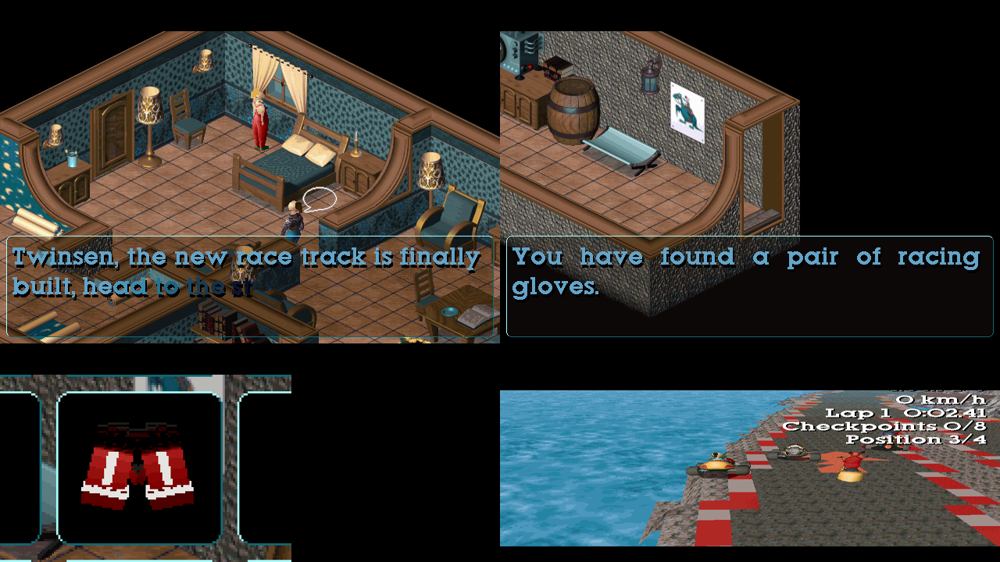

**Verified**:
- In the engine, a new game in scene 0: Zoe says text 996 (`[life] obj=4 MESSAGE dial=996`) and arrow 222 is on; the untouched game switches on 22. Her line shows in the game's dialogue box.
- The attic: the shelf actor is the gloves' body; after Action, item 7's count is 1, the darts' (2) untouched, the shelf gone; the found screen says "You have found a pair of racing gloves."; the inventory shows the gloves in the part's box.
- The race: the grid "1 Twinsen, 2 Baldino, 3 The racer, 4 The biker", GO, and the biker riding the lap on his bike with its riding animation, "Position n/4" on the display.
- The holomap: the island view in the engine shows the track on Citadel Island's picture.
- The menu build is byte-identical to the command-line build (all nine files, HOLOMAP.HQR, TEXT.HQR and OBJFIX.HQR now among the ones kept and put back). The suites pass.

## Mosquibees Island's mountain lap (2026-09-29)

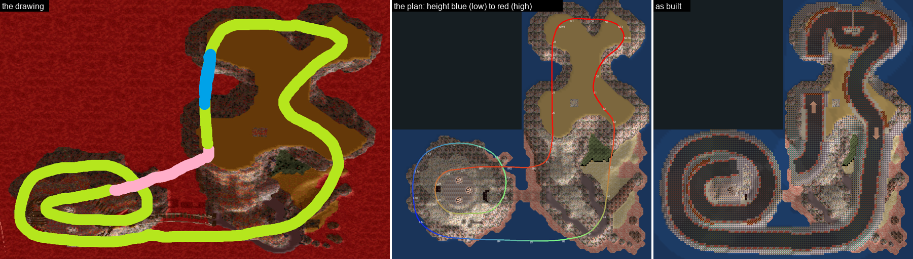

The drawing: a lap round the Mosquibees' mountain in two loops, up to a bridge (pink) over to the plateau, a jump (blue) along the plateau's west side, and back down. It had no pit lane; the build puts one beside the start line (below).

**The island.** MOSQUIBE.ILE is three cubes (7,8), (8,7) and (8,8); (7,7) is missing -- the engine's open sea. The Mosquibees' mountain (7,8) is a stepped cone: flanks steeper than 100 %, a 9,500 shelf, an 11,100 summit with the three landing pads. The plateau (8,7) is a mesa at 12,750 with cliffs all round and three bays cut into it (west, north, east). South of it a ridge (9,500-11,000) runs down to the low ground by the arrival (700-1,600); the sea channel between the mountain and the ridge is 13-17 cells wide. Outside scenes 102 (the plateau), 103 (the mountain) and 105 (the arrival); 104, numbered between them, is the Queen's throne inside the mountain.

**From the drawing to a plan** (`tools/RaceTrackPlan/fitcam.py`, `perspective_trace.py`, `mosquibe_design.py`). The drawing is the island seen at a slant, in perspective -- the high plateau drawn far bigger than the mountain -- so a flat fit of the picture does not work. A pinhole camera is fitted instead (position, turn, tilt, focal length) that turns the island's 3D ground into the drawing, scored by how well the land it would see covers the drawing's land (IoU 0.92). The drawn line is traced and each point put on the ground the camera sees behind that pixel. That trace is a guide, not the plan: the mountain's flanks are far too steep for a road to follow the ground, so the lap is designed by hand along it -- a closed spline through control points, with its own heights: straight grades keyed at points, a vertical curve (a parabola tangent to both grades) at every change, the start straight, the bridge deck and the jump exactly level.

**The lap**, 500 cells, 47.6 s for the race car driven by the test pilot (below):
- **The start line and the pit lane** on the plateau's north edge, the only long, level, open straight. The pit lane runs inside it (south); it is short (24 cells beside the lap), so it moves out from the lap over 7 cells instead of 24 (`pitTaper`), and the waiting spots are taken after the line too where the ones before it are still too near the lap (two before, two after, 7.4-9.2 cells to the side).
- The north-east hairpin (4.8 cells), an S-bend across the plateau, and **the descent** down its east side: 14 %, over the low ground on a walled causeway 5,000-9,000 high.
- **The bottom straight** along the south shore, over the channel's mouth, still coming down, to **the first loop's start at the mountain's south-west foot: 925, the lowest point of the lap, just above the sea.**
- **Two loops winding up round the mountain**, clockwise: the first round its flank, the second round the summit, 11.5 cells inside it and 5,000-8,000 above it -- terraces one above the other; at most 12.6 %.
- **The bridge**: from the mountain's shoulder a flat deck, 28 cells (7 tiles) at 11,100, over the first loop -- 5,265 above it, crossing at 65 degrees -- and over the channel to the ridge.
- Up the ridge (12 %) to **the jump over the plateau's west bay**: a ramp to a lip at 13,100 on the south-west arm, a 17-cell gap over the bay (the flight tops out 15,500 above the lava sea), a landing 3.4 cells down the ramp on the north-west arm; then the north-west corner to the line.

**The plan** (`docs/racetrack/mosquibe_track_plan.json`) carries more than the others: `heights` (one per point: the road follows them, cut into the mountain and built up over the sea, grade-limited to the plan's own `maxGrade`, 15.8 %), `deck` (the first and last point of the flat deck), `gapJump` (the take-off lip and the landing lip) and `pitTaper`. A plan with heights is built as drawn: no crossing is re-shaped and the crossing style doesn't apply (the dialog greys it out) -- except that the style still decides whether the deck is given its bodies in the island's OBL, so such a plan sets it itself (`RaceTrackService.FollowPlan`: a bridge when it draws a `deck`). The greyed-out box first kept whatever the folder's previous build had used, and a folder last built with the jump got a Mosquibees lap with no deck under its bridge (2026-09-29).

**What the builder does with a planned lap** (`Terrain/RaceTrackBuilder.cs`; none of it touches a plan without heights -- the Desert island's and Citadel Island's builds are byte for byte what they were):
- **Walled road** (`PlannedProfile`): wherever the road stands more than 1,200 off the ground -- built up over the sea or the low ground, or cut deep into the mountain -- it gets the water bridge's narrow level top with blocking rock at its edges instead of the 7-cell earth skirt, which spilled fill across whatever lies below: the sea, or the road on the next terrace. 367 cells of the lap.
- **Steep banks are blocking rock** (`WallSteepBanks`, and verge cells holding a step): the engine lifts a car straight onto higher ground it drives into, however much higher, unless the triangle blocks (EXTFUNC.CPP `ReajustPosExt`), so an ordinary bank beside a terrace was a ramp up the cliff to the next one. 918 cells.
- **The plan's deck** (`PlanDeck`): the flat tiles over the deck's points, lengthened to whole tiles, the ground just under their last cells and level with them for 4 cells beyond, the clearance over every part of the lap it crosses reported.
- **The gap jump** (`PlanGapJump`, the crossing jump's ramps and flight in `LayJump`): the road's own level, the ramps on it, and between the lips nothing -- the gap's ground is left as it is and not painted (`Void`). A checkpoint is kept away from it.
- **The sea under every cube**: the engine draws the sea in 4 x 4 squares, only those a cube's info word marks (`CubeBitField`); all are marked.

**The engine** (`native/lba2-classic-community`):
- **Ground across the near plane is drawn clipped** (TERRAIN.CPP `DrawFeuillePolyClipped`). A ground cell some of whose corners are behind the camera's near plane (3,000 units) was painted black from its visible edge down to the bottom of the screen -- right for flat ground passing under a camera close over it, which is off the bottom of the screen anyway, but on this lap the camera following the car passes a few cells from terrace walls, and whole sides of the view went black. Each of its two triangles is now clipped against the plane in the camera's space (`ClipperZ`, as the sea's `Draw_Poly`) and drawn with its own colour and texture. The retail islands look as they did.
  
- **A test pilot** for headless runs: the console's `autodrive 1 [look ahead]` steers and pedals the player's car along the first opponent's line (RACEMOD.CPP `RaceMod_AutoInput`), so a whole qualifying lap and race can be driven with no one at the keys. The race-track mode now logs each checkpoint, missed checkpoint and lap.
- The console's `cube` leaves any cutscene the old scene was in (a harness's jump straight after boot landed in the opening's `cinema_mode(1)`, which then held for the whole run: letterbox bars, and the Auto camera never ran); `screenshot [path]` takes a file name; `camtrace` shows the camera's eye.

**The scenes**: a cube change to any scene that isn't one of the island's own outside scenes is a door (the rule counted everything numbered from the first to the last outside scene, and 104 is the Queen's throne).

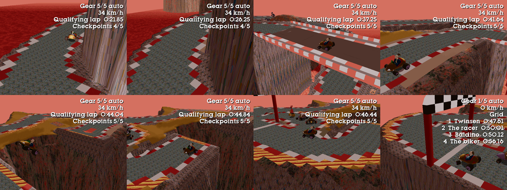
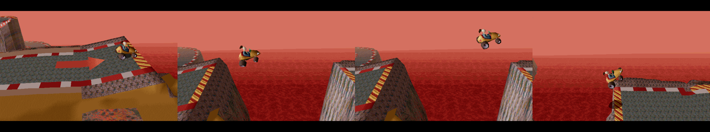

**Verified**, on a copy of the game:
- The test pilot drives the whole lap: the qualifying lap through all five checkpoints in 47.61 s, the grid (Twinsen, Baldino, the racer, the biker), GO, and race laps of 47.63 s and 47.50 s, the three opponents lapping in 48-52 s.
- Every cube edge the lap crosses, both ways (8 of 8, the deck's included, at deck height).
- The jump: the flight starts on the take-off strip, clears the bay and lands on the far ramp; the deck carries the car level at 11,100 over the first loop.
- The frames round the lap with both cameras: no black left in the view.
- The menu build is byte-identical to the command-line build; "Put the original files back" restores every file exactly.
- The holomap picture (HOLOMAP.HQR entry 32) has the track drawn in; the picture itself is the island as it was, so where the build raised or cut the ground a great deal the road is drawn over the old shapes.
  

**Two leftovers, and what caused them (2026-09-29)**. Driving the built lap turned up a Mosquibee's nest sitting on the asphalt and a plank walkway hanging in the sky. Both were general faults, fixed for every island; `ScriptRoundTrip trackleftovers <game folder> <ISLAND> <lap.csv>` is the probe that found them (the lap's centre line comes from a build run with `RT_DUMP=<file>`; `RT_BEFORE=<the untouched ILE>` tells what the build itself left hanging rather than what the island always had, and it lists the actors of the outside scenes the same way).

- **Objects were carried about by the ground under a corner of them** (`Terrain/IslandOps.cs`, `DecorFollow`). A decor keeps its height above the ground when the build reshapes it, read under the decor's own origin -- but an origin is not where the object rests: for many it is a corner of the box, and its `Y` is 0, the body itself being at `YMin..YMax`. Mosquibees Island's walkway is a row of planks on posts across a gully, so its origin stands over the gully floor; when the road's embankment filled that floor, the whole walkway rose 4,000 units into the air. Now a decor follows the ground only when it rests on it -- its underside at or below the highest ground anywhere under its footprint -- and one hanging clear of the ground is left where it is. (Following the *highest* ground under the footprint instead was tried and is wrong the other way: it lifted a small rock beside the new embankment onto the embankment's own height.)
- **A structure whose pieces stand apart was not recognised** (`RaceTrackBuilder.ClearRuins`). What the road ran through is cleared, and so are the orphaned pieces of the same structure -- but pieces counted as one structure only when their boxes touched within a quarter of a cell and lay within 64 units of each other in height. The walkway's planks are half a cell apart with a handrail a thousand units above them, so every plank was its own structure and nothing was cleared: the road went through the middle of it and left both halves standing over the drop. Pieces a little apart (`RuinGap` 0.6 cells) at much the same height (`RuinRise` 1,200) are now one structure too. The gap is deliberately small: reaching 1.5 cells merged whole hillsides into one structure, which then held a big piece and so nothing of it was cleared at all.
- **A kept actor standing on the road is moved aside** (`RaceTrackScenes.ShiftOffRoad`). The actors of the outside scenes are removed except the ones Twinsen's own script waits on in a cutscene; one of those was a Mosquibee's nest the second loop was laid straight through. Such an actor is now moved to the nearest spot clear of the road, in its own cube, on the new ground -- keeping the height above the ground it had, for one that doesn't fall. Not the ones on water: the harbour ferry waits there and sails a route of its own, as `Reseat` already allowed for. Citadel Island's circuit moves nine of them (the town's own scene 48), the Desert island none.

  

## The menu command

Tools > LBA2: Desert island race track... (`RaceTrackWindow.cs`, `Terrain/RaceTrackService.cs`) builds the track from the plan built into the program, or from a plan file. The crossing style (bridge, jump, viaduct or a plain level junction), clearing the old track, and the scene options are choices in the dialog.

The first build keeps `DESERT.ILE`, `DESERT.OBL`, `SCENE.HQR`, `ANIM.HQR` and `RESS.HQR` as `*.before-racetrack` beside the originals (a folder built before the jump used the last two keeps them from its next build on, while they are still the originals), and every build starts from those. "Put the original files back" restores them all and removes the copies and RACETRACK.JSON. "Race car setup…" opens the car setup. The editor's views are refreshed afterwards.

It was tested on a fresh copy of the game folder, with the bridge and with the jump (again on 2026-09-28 with the squared-up jump, checkpoints and opponent, and with Baldino's car: all six files): the result is byte-identical to the command-line build (all five files and RACETRACK.JSON), and restoring gives back the original files' hashes.

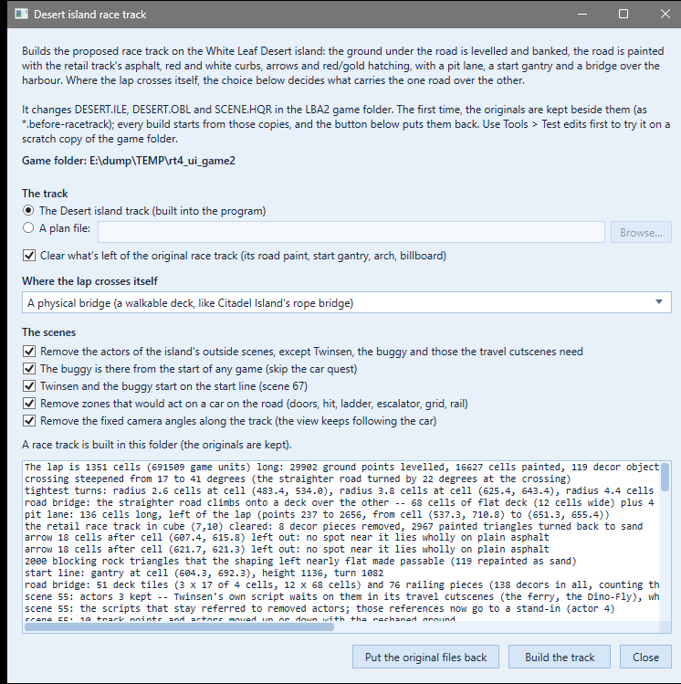

Extra commands in `ScriptRoundTrip`:

- `driveprep <game> <cellx> <cellz> <turn>`: the buggy and Twinsen ready on the road at a cell.
- `initbuggy <game> <scene>`.
- `scripttext <game> <scene> <actor> life|track`: a script as the editor's C text.
- `racetrack island <n>` and `racetrack <cx> <cz> --scripts --hero`.
