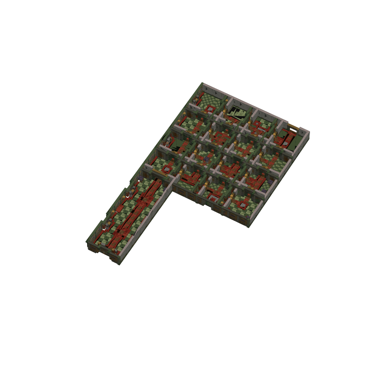
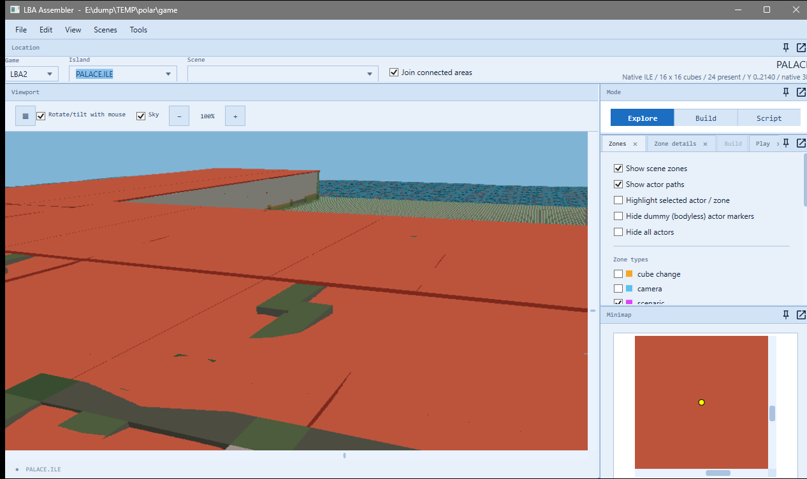

# The Palace island: Otringal's palace as a building of its own (2026-10-08)

The user: "We need to create a new track based on the Palace that's featured on Otringal, this will need to be recreated as a new island.
The idea behind this track is that the cars race through the inside of the palace, through the window by the chest that Twinsen normally
leaves by then around the roof tops. To accomodate all of this we'll probably need to scale up everything. After this is created we'll add
a track to it later, let's just get our Palace island created for now".

## What the palace is in the game

The Emperor's palace is not on Otringal's island file at all: it is an interior, a maze of sixteen rooms (scenes 151-166), each a grid of
13 x 13 cells, four by four, and the last room (scene 80: the chest, and the window Twinsen leaves by) off its fourth row. An interior's
cells are bricks -- pictures, not shapes -- so the palace has no 3D model to drive through.

## The island

`Terrain/Palace/PalaceIsland.cs` builds two new files, `PALACE.ILE` and `PALACE.OBL`:
- **The rooms where the doors between them put them**: the editor's joined map of the palace (`Lba2Areas`), without the cell it moves some
  rooms apart for its picture (neighbours share their walls here).
- **Scaled up for the cars**: every cell is a box 3 bricks across (1,536 units) and 2.5 layers high (640 units). The palace comes to
  168 x 303 cells of the island and 14 layers.
- **Colours**: each cell has its brick's average colour (the exporter's blocky map, `GridMesher`), matched in Otringal's palette (RESS 31)
  and shaded by the way the face points. Only the faces that show are kept, merged into rectangles of one colour.
- **Bodies**: each room's faces go in one body (or more where there are many: 540 points and 540 faces at most per body, inside the
  signed 16-bit range round its middle). Each is a decor whose box nothing touches, so it is only drawn. 52 bodies, 14,093 faces.
- **Collision**: the filled cells are merged into boxes, each a decor with an empty body: walls, floors, furniture (566 boxes with the roofs).
- **Rooftops**: each room gets a roof level with the top of its walls (the height most of its edge reaches), cut into slabs of 12 cells at
  most. The roofs are solid, so the cars can drive on them.
- **The ground**: `OTRINGAL.ILE`'s atlases and palette on 4 x 6 new cubes from cube (6, 6) (`IslandScaler.NewFile`), the palace in the
  middle, Otringal's paved courtyard painted round it as a plateau at the rooms' floor (2200), and the last 10 of its 28 cells falling to the sea.
- `PALACE.OBL` is `OTRINGAL.OBL` with the palace's bodies added at the end (from body 151 on).

No other file changes. The island has no scenes yet: the engine can't go there until a race track adds them. (The plan: the track's
scenes stay on Otringal's island number and the race file loads `PALACE.ILE` in its place, the way the Emerald Moon's track loads
`MOON.ILE`.)

## Making it

- Tools > **LBA2: Palace island (Otringal's palace)…** (`MainWindow.Palace.cs`) adds the two files to the game folder, builds them again,
  or takes them out. It is refused while test edits or the 1996 demo are open. The new island appears in the Island list
  (Otringal's palette).
- `ScriptRoundTrip palace <game folder> <out folder> [source folder] [--no-roofs]` builds the same files into another folder. The source
  folder holds pristine `OTRINGAL.ILE` and `.OBL` (the game folder by default). `--no-roofs` leaves the roofs off so you can see inside,
  as in the first picture (`--export` of that folder).
