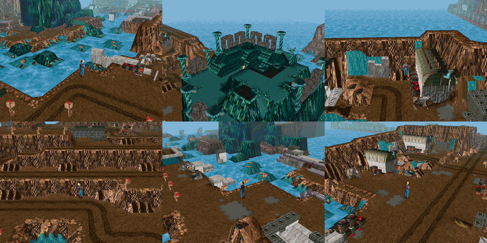
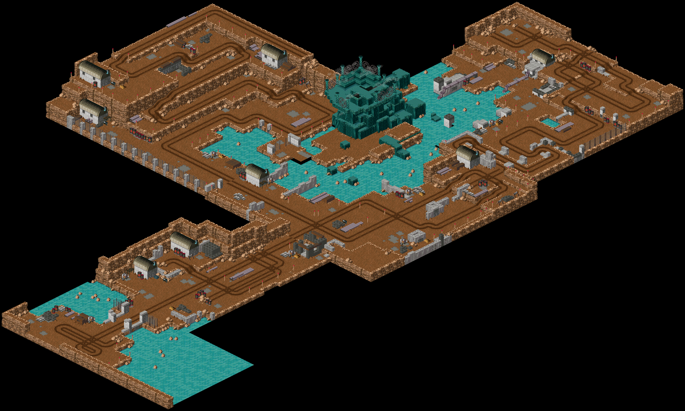
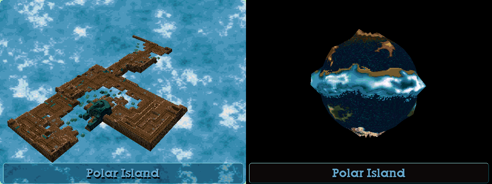

# Polar Island: LBA1's Polar Island as a new LBA2 island (2026-10-05)



LBA1's Polar Island is six outside scenes, each a fixed isometric view. Here they become island 12 of LBA2: one island you can walk round
and look at from any side, in LBA2's own engine.

**To use it:** Tools > **LBA2: Polar Island (from LBA1)…** in LBA Assembler. You need both game folders set under File > Settings (it
reads LBA1's scenes). The same menu builds the island again or takes it out. Then pick `POLAR.ILE` in the Island list and Play any of its
scenes; Twinsen starts on the dock.

**Only LBA Assembler's own engine loads island 12.** The engine changes are listed below; the original `LBA2.EXE` doesn't load it.

## The layout



The outside scenes are joined where their cube-change zones say they meet (`Terrain/Polar/PolarLayout.cs`):

```
115 1st scene (the dock) -- 106 2nd scene -- 107 3rd scene -- 108 before the rocky peak (west of 107)
                                                           -- 109 4th scene (north of 107)
```

The scenes don't fit together exactly:

* **The rocky peak (110):** 108's gate leads to 110, the crystal mountain. Put where its zones say, 110 lands on top of 107. 107's north
  corner already holds the same mountain, only cut off at the grid's edge and in a slightly different place. So 110 is left out. Its
  mountain is matched against 107's (the offset where most of its tall columns stand equally high in 107) and used to make 107's
  mountain whole.
* **The plateau (111):** "On the rocky peak", the plateau of twisted pillars, goes on top of that mountain, at the offset the 110 ↔ 111
  zones give. Its own teal floor far below the plateau is a backdrop and is left out.
* **The gate:** across the water from 108's gate, a causeway of the gate's own ground leads onto 107's path to the mountain. It is four
  cells long.

## The ground (`PolarTerrain.cs`)

An LBA1 scene is bricks in 64 × 25 × 64 cells. An LBA2 island is a height map of textured triangles. A cell is the same size in both
(512 world units across, 256 a layer).

* **What counts as ground:** a cell's block-library code decides it:
  * Ground: dirt (6x), the small dirt and grey patches (06, 77), water (F1), crystal (Ax), and brown or teal rock (00 bricks that aren't
    grey).
  * Not ground: grey 00 (concrete walls, crates), metal (22: huts, barrels, pipes), wood (33) and F0 (posts, fences, gates, pillars).
    These become objects.
* **Heights:** each column's ground is its highest ground cell. Each corner of the height map takes the highest of its four cells, so a
  ledge keeps its edge and the cell below it slopes up to it.
* **Textures:** a ground cell is textured with its brick's top face, unskewed from the sprite's diamond into a 16 × 16 tile of the
  island's ground atlas. Colours map to the nearest of the palette's lit colours; the palette is the fine-weather Citadel's.
* **Cliffs:** a cell that climbs two layers or more takes the side face of the column it climbs to, turned so its top runs along the
  slope's high edge. Slopes steeper than 40° get the engine's own collision bit, so they are walls; one-layer steps stay walkable.
* **Banks:** water next to land is drawn as a bank sloping down into LBA2's sea, in the land's side texture. It is still water to
  Twinsen. Isolated rocks in the lake become small mounds instead of floating plates.
* **Enclosed water:** water with land on all four corners is drawn flat with LBA1's own water texture.
* **Open water:** everything else is left undrawn, so the engine's sea shows through.

## The objects (`PolarObjects.cs`, `PolarTextures.cs`)

What isn't ground is built as island objects: 285 bodies in `POLAR.OBL`, one decor each.

* **Boxes:** each piece of touching object cells, in chunks of up to 8 × 8 columns, is a body of boxes, one box per cell.
* **Faces:** every face of a box that something else doesn't cover is drawn, including the sides LBA1 never drew (−x and −z). Those take
  the opposite side's texture, so nothing is see-through when you turn round.
* **Thin objects:** a box is the part of its cell the brick fills, read from the brick's outline. A post is a thin box; a wall fills its
  cell.
  * A box's outline fixes its middle and the sum of its width and depth; of the boxes that fit, the one whose outline is most like the
    brick's wins.
  * Bricks that draw little of their cell get their nearest box even when the fit is poor. LBA1 splits a post's picture among the bricks
    of every cell it crosses *on the screen*, so a brick may hold just one piece of a post, or the roots of another.
* **Mist:** the plateau's mist is dithered sparkle, mostly lone pixels. No solid object can show that, so those bricks are left out.
* **Textures:** each face is textured with its brick's face. Where the sprite hardly draws that face, it uses the face the brick draws
  most of; failing that, the brick's commonest colour.
* **Gotcha:** each atlas tile needs its own entry in the body's texture table (its place in the page plus a 16-pixel repeat mask). One
  entry for the whole page, `0xFFFF0000`, is what the engine takes for a placeholder: it draws the polygon in its flat colour instead,
  which came out black (`AFF_OBJ.CPP`).

## The scenes (`PolarScenes.cs`)

An LBA2 outside scene is one cube of its island. The island has twelve cubes (6–8 × 5–8), numbered as scenes 229–240. The ten with land
have scenes: **230–237, 239 and 240**. The two of open sea (229, 238) have none, and no zone leads into them; Twinsen would drown before
he got there.

* **Numbers:** they start after the retail game's scenes (up to 221) and the race track builder's (222–228).
* **Contents:** each is a copy of scene 44's header with island 12 and its own cube. Nobody is in it but Twinsen and the engine's Zoe
  placeholder.
* **Cube changes:** a cube-change zone runs along every edge a cube shares with another (`OBJECT.CPP` `GereZoneChangeCube`: the arrival
  edge in Info0/Info2, 512 or 31744).
* **Start:** Twinsen starts where LBA1 starts him on the island: on the dock (LBA1 scene 115), in scene 239. In the other scenes he
  starts on the flat, clear land cell nearest the cube's middle, so Play from any scene puts him on his feet.
* **Names:** each scene is named in the game folder's `SCENE.HQD` after the LBA1 scenes its land comes from (for example "Polar Island:
  1st scene, 2nd scene"). The editor's scene list reads that file over the game's own descriptions.

## The holomap



* **Map entries:** the retail `HOLOMAP.HQR` has map pairs up to entry 45, and slot 12's pair is already taken (the fine-weather
  Citadel's). Polar Island's picture and camera are appended as entries 46 and 47.
* **Picture:** the island's ground drawn through its camera over a calm sea in the Citadel picture's colours (`HolomapPicture`).
* **Globe:** position record 12 puts the island on the planet near its north pole. Its label is text 620 of the game text file
  ("Polar Island"), added in every language.
* **Scene records:** each scene's record (50 + scene) marks it as an outside scene of island 12. The cube-change zones test this flag.

## Engine changes (`native/lba2-classic-community`)

| Where | Change |
| --- | --- |
| `EXTFUNC.CPP` `IleLst`, `3DEXT/RENDERER_API.CPP` `kIslandNames` | Island 12 is `"polar"`. |
| `HOLO.H` `MAX_ISLAND` | 13. `HOLOPLAN.CPP`'s zoom and arrow scale tables gain island 12, which was read past their end. |
| `HOLOPLAN.CPP` | Island 12's map is entries 46/47. |
| `MESSAGE.CPP` `TextEntry` | Island 12's text file (file 15, one past the retail 15 per language) is a pair of `TEXT.HQR` entries per language after the retail block: entries 180–191. |
| `MESSAGE.CPP` `ListFileText` | Gains `"012"`. Island 12 read past its end when building a voice file name. |
| `DISKFUNC.CPP` | A scene's planet is read only for an island the holomap table has. |
| `SAVEGAME.CPP` | Loading a save first tries the old 64-bit record layout and accepts it only if every actor's body index is in range. A Polar scene has just Twinsen and the Zoe placeholder, mostly zeros, so its saves passed that check, were misread, and crashed in `ObjectSetInterDep`. Now the old layout is accepted only if Twinsen's animation state also reads whole (1–30 groups, frames inside the animation). The 13 LBA2 saves on this PC still load. |

## What the build changes in the game folder

| File | Change |
| --- | --- |
| `POLAR.ILE`, `POLAR.OBL` | New. |
| `RESS.HQR` | Entries 23 (island 12's sky, the fine-weather Citadel's) and 39 (its palette). Both are empty in the retail file. |
| `SCENE.HQR` | Scenes 230–237, 239, 240. The slots before them are padded empty. |
| `HOLOMAP.HQR` | Entries 46 and 47; position records 12 and those of the scenes (280–287, 289, 290). |
| `TEXT.HQR` | Entries 180–191; text 620 of file 2 in each language. |
| `SCENE.HQD` | The scenes' names. |

* **Backups:** before the first build, the four HQR files are copied to `*.before-polar`.
* **Removal:** taking the island out removes exactly what the build added, putting replaced entries back from those copies. Everything
  else changed in the folder since stays. Checked: add, rebuild, remove on a copy of the retail files leaves every entry as it was.
* **Read-only files:** the retail files are read-only on GOG installs, so the build makes the files it changes writable.
* **Race track builder:** its "put the folder back" restores its own copies of `SCENE.HQR`, `RESS.HQR`, `HOLOMAP.HQR` and `TEXT.HQR`. A
  track built *before* Polar Island was added would take the island's scenes out with it. Add the island again afterwards.

## Testing

`tools/ScriptRoundTrip`:

| Command | What it does |
| --- | --- |
| `polarinstall <LBA1> <game>` | Builds and writes the island; no copies. |
| `polaradd` / `polarremove` | The menu's add and remove. |
| `polarsame <a> <b>` | Compares the shared files entry by entry. |
| `polarlayout` | Draws the joined LBA1 picture. |
| `polarfoot` | Each object brick's fitted box. |
| `polarsheet` | Bricks drawn over their cells. |
| `polarcubes` | Which LBA1 scenes fill each cube. |
| `polartall` | The tall columns. |
| `polaratlas` | The atlases. |

Headless engine checks (sandbox copy of the game):

* `cube 239` loads island 12 with Twinsen standing on the dock. Every scene starts with Twinsen standing at full life.
* A save made on the island loads.
* Walking north across the cube edge changes to scene 236.
* `ui holoplan 12` and `ui holomap` show the new map and the label.
* LBA Assembler's menu adds the island in a sandbox: `POLAR.ILE` is listed, its ten named scenes appear, and Play starts them inside the
  window.

## Not yet

* **Characters:** none yet. LBA1's actors and their scripts aren't ported.
* **Getting there:** no way in from the story: Play, or `cube 239`.
* **Shapes:** objects are boxes, so the huts' curved roofs are square, and a post split over several bricks is a few small boxes.
* **Missing scene:** the rocky peak's own scene (110) isn't a separate place: its mountain is 107's.
